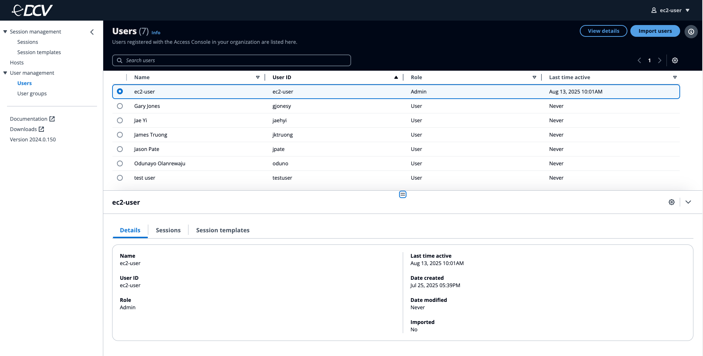

# Amazon DCV Infrastructure Deployment Guide

## Architecture Diagram

## Solution Overview

The Amazon DCV infrastructure leverages AWS services to provide a secure and scalable virtual workstation solution, deployed across public and private subnets within a VPC. The architecture uses AWS Image Builder to create hardened AMIs for its core components: a web-based Access Console for user management, Connection Gateways behind a Network Load Balancer to handle client connections, a Session Manager to orchestrate sessions, and an auto-scaling DCV Fleet Server group with EFS storage to host the actual remote sessions. This design implements defense-in-depth security through network segmentation, ensures high availability across multiple Availability Zones, and provides automated scaling to accommodate varying workloads while maintaining consistent performance and security standards.

The solution is comprised of five CloudFormation Stacks:

1. The DCV infrastructure stack deploys key components including a Session Manager, an auto-scaling Connection Gateway behind a Network Load Balancer, an auto-scaling DCV Fleet Server group, and an optional Access Console. The infrastructure is secured with specific IAM roles, security groups, and optional VPC endpoints. It includes detailed UserData scripts for each component to handle installation and configuration of DCV services, AWS CLI, and necessary software. The template provides extensive customization options through parameters, allowing users to specify instance types, AMIs, subnet choices, and scaling configurations, while also integrating EBS and EFS storage options for persistent data management.

2. The Session Manager Image Builder stack creates an AWS Image Builder pipeline specifically designed for building DCV Session Manager AMIs with enhanced security features. The pipeline includes four main components: a base DCV Session Manager installation component, a STIG (Security Technical Implementation Guide) component that implements DoD security controls, a supplemental STIG component for additional security packages (like USBGuard and Smart Card support), and a SCAP (Security Content Automation Protocol) Compliance Checker component that validates the security posture. The template handles proxy configurations, and includes comprehensive logging and notification systems.

3. The Connection Gateway Image Builder stack creates an AWS Image Builder pipeline specifically for building DCV Connection Gateway AMIs. The pipeline includes components for installing and configuring the DCV Connection Gateway software, handles proxy configurations, and implements security features through KMS encryption and IAM roles with permission boundaries. It sets up all necessary infrastructure including security groups, instance profiles, and networking configurations, while supporting both x86_64 and ARM64 architectures. The resulting AMI includes the DCV Connection Gateway configured for web access and systems management capabilities through AWS Systems Manager.

4. The Fleet Server Image Builder stack creates an AWS Image Builder pipeline for building DCV Fleet Server AMIs with GPU support and enhanced remote visualization capabilities. The pipeline consists of three main components: a base component for system preparation and GPU driver installation, a main component for DCV Server and Session Manager Agent installation, and a validation component to verify system configuration after reboot. It features automated setup of X Server configuration, NVIDIA GPU driver installation and confgiuration, DCV server configuration, and session manager integration, while providing email notifications for pipeline events through SNS. The template is highly configurable through parameters and includes conditional resource creation based on the deployment environment, making it suitable for both GPU and non-GPU instances across different AWS partitions.

5. The Access Console Image Builder stack creates an AWS Image Builder pipeline for building DCV Access Console AMIs. The pipeline includes components for installing and configuring the DCV Access Console software, implementing STIG (Security Technical Implementation Guide) controls, applying custom STIG remediations, and running SCAP (Security Content Automation Protocol) Compliance Checker. The resulting AMI includes the DCV Access Console with enhanced security features, STIG compliance, and systems management capabilities through AWS Systems Manager.

## Deployment Steps

### A. Deploy DCV Infrastructure Stack

1. Log into the AWS account
2. Navigate to CloudFormation console
3. Click Create stack
4. Choose Upload a template file
5. Upload **"01-dcv-infrastructure.yaml"**
6. Click Next
7. Enter a Stack Name - (EX. DCV-Infrastructure-Stack)
8. Provide the following parameters:
   - IAM Prefix (AFC2S)
   - Permission Boundary Policy ARN
   - Proxy Server Address
   - Create or Use Existing VPC (True/False)
     - If False - Provide Existing VPC ID and Cidrs for Existing VPC Configuration
     - If True - Provide Cidr for New VPC Configuration
   - KeyPair
   - Session Manager Broker Instance Type
   - Session Manager AMI ID (This will be updated later with AMI generated from ImageBuilder pipeline)
   - Connection Gateway Instance Type
   - Connection Gateway AMI ID (This will be updated later with AMI generated from ImageBuilder pipeline)
   - Fleet Server Instance Type
   - Fleet Server AMIN ID (This will be updated later with AMI generated from ImageBuilder pipeline)
   - Auto Scaling Group Min Size
   - Auto Scaling Group Max Size
   - Auto Scaling Group Desired Capacity
   - CPU Utilization Target
   - Create DCV Access Console (True/False)
   - Access Console Instance Type
   - Access Console AMI ID (This will be updated later with AMI generated from ImageBuilder pipeline)
   - EBS Volume Size
   - EBS Volume Type
   - EFS Filesystem IDs and Mount Points
9. Click Next
10. Under the Capabilities section, check the acknowledgment box
11. Click Next
12. On the Review and create page, review all the options and click on Submit button to deploy the stack.

### B. Deploy DCV Session Manager ImageBuilder Pipeline

1. Log into the AWS account
2. Navigate to CloudFormation console
3. Click Create stack
4. Choose Upload a template file
5. Upload **"02-dcv-session-manager-imagebuilder.yaml"**
6. Click Next
7. Enter a Stack Name - (EX. DCV-Session-Manager-Pipeline)
8. Provide the following parameters:
   - IAM Prefix (AFC2S)
   - Permission Boundary Policy ARN
   - Email Endpoint
   - Image Builder Semantic Version
   - Parent Image
   - Parent Image Instance Type
   - VPC ID
   - Subnet ID
   - Outbound Cidr IP
   - Proxy Server Address
   - No Proxy List
   - DCV Resource Bucket Name
9. Click Next
10. Under the Capabilities section, check the acknowledgment box
11. Click Next
12. On the Review and create page, review all the options and click on Submit button to deploy the stack.

### C. Deploy DCV Connection Gateway ImageBuilder Pipeline

1. Log into the AWS account
2. Navigate to CloudFormation console
3. Click Create stack
4. Choose Upload a template file
5. Upload **"03-dcv-connection-gateway-imagebuilder.yaml"**
6. Click Next
7. Enter a Stack Name - (EX. DCV-Connection-Gateway-Pipeline)
8. Provide the following parameters:
   - IAM Prefix (AFC2S)
   - Permission Boundary Policy ARN
   - Email Endpoint
   - Image Builder Semantic Version
   - Parent Image
   - Parent Image Instance Type
   - VPC ID
   - Subnet ID
   - Outbound Cidr IP
   - Proxy Server Address
   - No Proxy List
   - DCV Resource Bucket Name
9. Click Next
10. Under the Capabilities section, check the acknowledgment box
11. Click Next
12. On the Review and create page, review all the options and click on Submit button to deploy the stack.

### D. Deploy DCV Fleet Server ImageBuilder Pipeline

1. Log into the AWS account
2. Navigate to CloudFormation console
3. Click Create stack
4. Choose Upload a template file
5. Upload **"04-dcv-fleet-server-imagebuilder.yaml"**
6. Click Next
7. Enter a Stack Name - (EX. DCV-Fleet-Server-Pipeline)
8. Provide the following parameters:
   - IAM Prefix (AFC2S)
   - Permission Boundary Policy ARN
   - Email Endpoint
   - Image Builder Semantic Version
   - Parent Image
   - Parent Image Instance Type
   - VPC ID
   - Subnet ID
   - Outbound Cidr IP
   - Proxy Server Address
   - No Proxy List
   - DCV Resource Bucket Name
9. Click Next
10. Under the Capabilities section, check the acknowledgment box
11. Click Next
12. On the Review and create page, review all the options and click on Submit button to deploy the stack.

### E. Deploy DCV Access Console ImageBuilder Pipeline

1. Log into the AWS account
2. Navigate to CloudFormation console
3. Click Create stack
4. Choose Upload a template file
5. Upload **"04-dcv-access-console-imagebuilder.yaml"**
6. Click Next
7. Enter a Stack Name - (EX. DCV-Access-Console-Pipeline)
8. Provide the following parameters:
   - IAM Prefix (AFC2S)
   - Permission Boundary Policy ARN
   - Email Endpoint
   - Image Builder Semantic Version
   - Parent Image
   - Parent Image Instance Type
   - VPC ID
   - Subnet ID
   - Outbound Cidr IP
   - Proxy Server Address
   - No Proxy List
   - DCV Resource Bucket Name
9. Click Next
10. Under the Capabilities section, check the acknowledgment box
11. Click Next
12. On the Review and create page, review all the options and click on Submit button to deploy the stack.

### F. Run Image Builder Pipeline to Create AMIs
1. Navigate to EC2 ImageBuilder Console
2. Click Image pipelines
3. Click dcv-session-mgr-ami
4. Select Action and Run pipeline
5. Wait for pipeline run to complete until Image status changes to Available
6. Copy newly create AMI
7. Repeat steps 3-6 for the other three pipelines (dcv-connection-gwy-ami, dcv-fleet-server-ami and dcv-access-console-ami)

### G. Update the Insfrastructure Stack with latest Session Manager AMI

1. Navigate to CloudFormation console
2. Select the DCV-Infrastructure-Stack
3. Click Update Stack and Make direct update
4. Select Use existing template
5. Click Next
6. Scroll to the DCV Session Manager Configuration section
7. Update the Session Manager AMI ID with latest AMI produced by the pipeline
8. Click Next
9. Under the Capabilities section, check the acknowledgment box
11. Click Next
12. Click Submit.

This step creates a new Session Manager instance and stores its private dns, session manager credentials and broker certifacte in the parameter store for future use.

### H. Update the Insfrastructure Stack with latest Connection Gateway and Fleet Server AMI

1. Navigate to CloudFormation console
2. Select the DCV-Infrastructure-Stack
3. Click Update Stack and Make direct update
4. Select Use existing template
5. Click Next
6. Scroll to the DCV Connection Gateway Configuration section
7. Update the Connection Gateway AMI ID with latest AMI produced by the pipeline
8. Scroll to the DCV Fleet Server Configuration section
7. Update the DCV Server AMI ID with latest AMI produced by the pipeline
9. Click Next
10. Under the Capabilities section, check the acknowledgment box
11. Click Next
12. Click Submit.

### I. Update the Insfrastructure Stack with latest Access Console AMI

1. Navigate to CloudFormation console
2. Select the DCV-Infrastructure-Stack
3. Click Update Stack and Make direct update
4. Select Use existing template
5. Click Next
6. Scroll to the Deploy Access Console section
7. Select 'True' to create Access Console
8. Update the Access Console AMI ID with latest AMI produced by the pipeline
9.  Click Next
10. Under the Capabilities section, check the acknowledgment box
11. Click Next
12. Click Submit.

13. Wait for CloudFormation to complete. Even after the stack is complete, DCV Access console is still being deployed and configured on the back end.
14. To verify successful deployment, SSM into access console EC2 instance
    In the terminal, run the following commands:
    - sudo -i
    - cd /var/log
    - tail -f cloud-init-output.log
  
15. Watch the deployment, until you get a successful installation similar to image below. 
    

16. Create a password for admin user (ec2-user) by running the following commands:
    1.  passwd ec2-user
    2.  enter desired password
    3.  re-enter desired password
    
17. Teminate SSM session

### J. Access the DCV Access Console and Manage Users and Session
1. Navigate to EC2 Console
2. Click instances
3. Select the "DCV-DcvInfraStack/AccessConsoleInstance"
4. Select the details tab and copy the public DNS of the DCV access console instance
5. Open a browser and paste in the copied adddress
6. Enter username: "ec2-user
7. Enter password created in earlier step
8. Once logged as Admin, you be able to create sessions, session template for users, manage users and user groups and see information of all DCV host within your environment.

This completes the deployment of Amazon DCV Workstation solution.

## License.

© 2025 Amazon Web Services, Inc. or its affiliates. All Rights Reserved.
This AWS Content is provided subject to the terms of the AWS Customer
Agreement available at http://aws.amazon.com/agreement or other written
agreement between Customer and either Amazon Web Services, Inc. or Amazon
Web Services EMEA SARL or both
