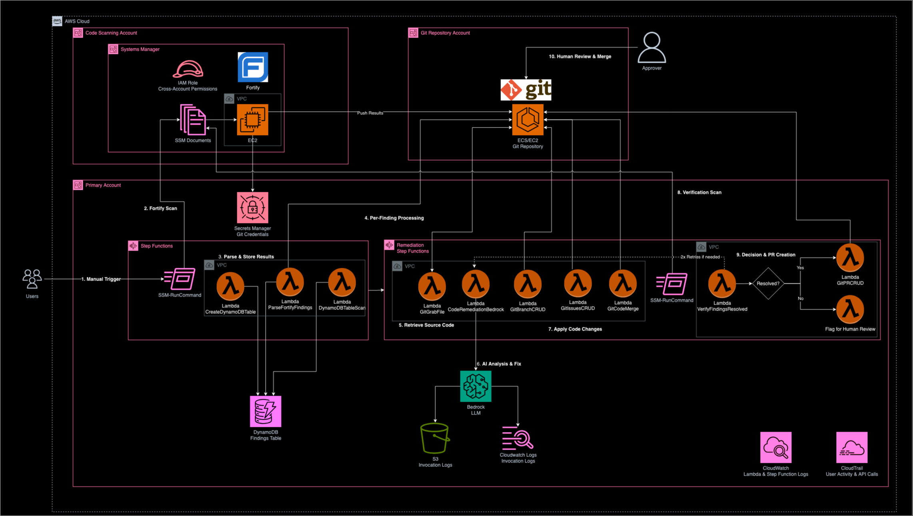

<!--
Copyright © Amazon.com and Affiliates: This deliverable is considered Developed Content as defined in the AWS Service Terms and the SOW between the parties.
-->

# Denali GenAI Code Modernization Workstream: Automated Security Remediation

An intelligent, automated security vulnerability remediation system that leverages AWS Step Functions, Lambda, and Amazon Bedrock to analyze, fix, and validate security issues in your codebase.

## 🎯 Overview

This system transforms traditional security vulnerability management from a manual, time-intensive process into an automated, AI-powered workflow. It integrates with your existing development tools (Git repositories, Fortify scans) and uses Large Language Models through Amazon Bedrock to generate intelligent code fixes.

### Key Benefits
- **Automated Remediation**: AI-powered fixes for common security vulnerabilities
- **Integrated Workflow**: Seamless integration with Git repositories
- **Scalable Processing**: Handles multiple vulnerabilities in parallel
- **Human Oversight**: Maintains human review and approval in the process
- **Audit Trail**: Complete tracking of all remediation activities

## 🏗️ Architecture



The system uses a microservices architecture built on AWS serverless technologies:

- **AWS Step Functions**: Orchestrates the entire remediation workflow
- **AWS Lambda**: Executes individual processing steps (Git operations, AI analysis, etc.)
- **Amazon Bedrock**: Provides AI-powered code analysis and remediation
- **Amazon DynamoDB**: Stores vulnerability findings and remediation status
- **AWS Systems Manager**: Triggers Fortify scans on EC2 instances
- **Git Integration**: Manages code changes, branches, and pull requests

## 🔄 Denali GenAI Code Modernization Workflow

The automated remediation process follows these steps:

1. **Manual Trigger** - User initiates vulnerability remediation workflow
2. **Fortify Scan** - Execute security scan on target repository
3. **Parse & Store Results** - Extract findings from FVDL and store in DynamoDB
4. **Per-Finding Processing** - Launch secondary workflow for each vulnerability
5. **Retrieve Source Code** - Fetch vulnerable code from Git repository
6. **AI Analysis & Fix** - Bedrock LLM analyzes code and generates remediation
7. **Apply Code Changes** - Create branch and apply AI-generated fixes
8. **Verification Scan** - Run post-remediation scan to validate fix
9. **Decision & PR Creation** - Create Pull Request if fix successful, flag if failed
10. **Human Review & Merge** - Security reviewer approves and merges changes

## 🚀 Quick Start

### Prerequisites
- AWS Account with appropriate permissions
- Python 3.9+ and Node.js 20+
- Docker installed and running
- Access to Amazon Bedrock models (Claude 3.5 Sonnet)
- Git repositories for source code and scan results

### 1. Clone and Setup
```bash
git clone <repository-url>
cd ai-ml-workstream

# Create virtual environment
python3 -m venv .venv
source .venv/bin/activate

# Install dependencies
pip install -r requirements.txt
npm install -g aws-cdk
```

### 2. Configure Your Environment
Copy the example configuration and customize it for your environment:
```bash
# Copy the example configuration file
cp config/example_deployment_config.yaml config/deployment_config.yaml

# Edit with your specific values
nano config/deployment_config.yaml  # or use your preferred editor

Edit `config/deployment_config.yaml`:
```yaml
namespace: "your-name"  # Replace with your identifier
version: "v1"
region: "us-gov-west-1"
permissions:
  boundary_policy_arn: "arn:aws-us-gov:iam::YOUR-ACCOUNT-ID:policy/YourPolicyName"
  role_prefix: "AFC2S"
networking:
  vpc_id: "vpc-YOUR-VPC-ID"
  subnets:
    - subnet_id: "subnet-YOUR-SUBNET-ID-1"
      availability_zone: "us-gov-west-1a"
    - subnet_id: "subnet-YOUR-SUBNET-ID-2"
      availability_zone: "us-gov-west-1b"
  security_group_id: "sg-YOUR-SECURITY-GROUP-ID"
```

### 3. Deploy Infrastructure
```bash
# Bootstrap CDK (first time only)
make bootstrap

# Deploy the infrastructure
make deploy
```

### 4. Verify Deployment
```bash
# Check deployed stacks
aws cloudformation describe-stacks --stack-name your-namespace-v1-LambdaStack
aws cloudformation describe-stacks --stack-name your-namespace-v1-StepFunctionsStack

# List Step Functions
aws stepfunctions list-state-machines --region us-gov-west-1
```

## 📁 Project Structure

```
ai-ml-workstream/
├── README.md                           # This file
├── app.py                             # CDK application entry point
├── Makefile                           # Deployment automation
├── requirements.txt                   # Python dependencies
├── requirements-dev.txt               # Development dependencies
├── config/
│   ├── deployment_config.yaml         # Main configuration file
│   └── config.py                      # Configuration loading logic
├── stacks/
│   ├── lambda_stack.py                # Lambda functions and IAM roles
│   └── step_functions_stack/          # Step Functions definitions
│       ├── step_functions_stack.py    # Step Functions CDK stack
│       ├── lambdas/                   # Lambda function source code
│       └── step_functions/            # Step Function JSON definitions
├── docs/
│   ├── architecture/                  # Architecture diagrams
│   └── deployment/                    # Detailed deployment guide
├── bootstrap/                         # Custom CDK bootstrap templates
│   ├── custom-bootstrap-template.yaml # AFC2S-compliant bootstrap template
│   ├── bootstrap-parameters-projadmin.json # Bootstrap parameters
│   └── scripts/                       # Bootstrap deployment scripts
│       ├── deploy_bootstrap.sh        # Bootstrap deployment script
│       └── check_bootstrap_roles.py   # Role validation script
├── layers/                            # Lambda layers for shared dependencies
├── reference-docs/                    # Additional documentation
│   ├── DEPLOYMENT_GUIDE.md           # Comprehensive deployment guide
│   └── CUSTOM_BOOTSTRAP_REQUIREMENTS.md # Bootstrap setup requirements
└── tests/                            # Unit and integration tests
    └── unit/                         # Unit test files
```

## 🔧 Configuration

### Lambda Functions
The system includes these Lambda functions (configurable names):

| Function | Purpose | Default Name |
|----------|---------|--------------|
| Git Branch CRUD | Branch management operations | `Git_Branch_CRUD` |
| Git Issues CRUD | Issue tracking operations | `Git_Issues_CRUD` |
| Git Code Merge and Push | Code integration operations | `Git_Code_Merge_and_Push` |
| Create DynamoDB Table | Database table management | `Create_DynamoDB_Table` |
| Parse Fortify Findings | FVDL parsing and processing | `Parse_Fortify_Findings_into_DynamoDB` |
| DynamoDB Table Scan | Vulnerability data retrieval | `DynamoDB_Table_Scan` |
| Bedrock LLM Call | AI-powered code analysis | `Code_Remediation_Bedrock` |
| Git File CRUD | File-level Git operations | `Git_Grab_File` |
| Verify Findings Resolved | Post-fix validation | `Verify_Findings_Resolved` |
| Git PR CRUD | Pull request management | `Git_PR_CRUD` |

### Key Configuration Options

**Severity Filtering**: The `dynamodb_table_scan` lambda supports filtering by vulnerability severity:
- Missing `minSeverity`: Returns findings of any severity
- Set `minSeverity` to `4`: Returns only High and Critical findings
- Supports values 1-5 (Low to Critical)

**Branch Management**: The `git_branch_crud` lambda supports different creation behaviors:
- Default: Standard branch creation
- `create_behavior: "delete_if_exists"`: Deletes existing branch before creating new one

## 🔐 Security Features

### AWS Security Compliance
- **IAM Roles**: All roles use AFC2S prefix and permissions boundaries
- **VPC Deployment**: Lambda functions deployed in private subnets
- **Least Privilege**: Minimal required permissions for each component
- **Encryption**: Data encrypted at rest and in transit

### Code Security
- **Secure Git Operations**: API tokens stored in AWS Secrets Manager
- **Input Validation**: All user inputs validated and sanitized
- **Error Handling**: Comprehensive error handling prevents information leakage
- **Audit Logging**: All operations logged to CloudWatch

## 🛠️ Advanced Usage

### Custom Repository Configuration
To use your own Git repositories:

1. **Update Secrets Manager**:
   ```bash
   aws secretsmanager update-secret \
     --secret-id "git/api/token" \
     --secret-string "your-git-api-token"
   ```

2. **Configure Network Access**: Ensure Lambda functions can reach your Git server

3. **Update SSM Document**: Modify the Fortify scan document with your repository URLs

### Cross-Account Deployment
For deploying across AWS accounts:

1. **Fortify Account**: Create cross-account IAM role and SSM document
2. **Solution Account**: Update Step Functions to assume cross-account role
3. **Network Configuration**: Set up VPC peering or Transit Gateway if needed

### Monitoring and Observability
- **CloudWatch Logs**: All Lambda functions log to CloudWatch
- **Step Functions Monitoring**: Built-in execution tracking and error handling
- **Custom Metrics**: Emit custom metrics for remediation success rates
- **Bedrock Logging**: Optional model invocation logging for compliance

## 📚 Documentation

- **[Deployment Guide](docs/deployment/DEPLOYMENT_GUIDE.md)**: Comprehensive deployment instructions
- **[Architecture Documentation](docs/architecture/)**: Detailed system architecture
- **[Security Guidelines](.kiro/steering/security-remediation-guidelines.md)**: Security implementation standards
- **[Bootstrap Requirements](reference-docs/CUSTOM_BOOTSTRAP_REQUIREMENTS.md)**: Custom CDK bootstrap setup

## 🧪 Testing and Execution

### Current Test Status
The project currently has placeholder test files but no implemented unit tests. The test framework is set up for future development.

### Triggering the Workflow

To trigger the main remediation workflow, use this sample JSON payload:

```json
{
  "mainBranch": "main",
  "scanResultsRepo": "https://your-git-server.com/api/v1/repos/owner/repository-scan-results.git",
  "codeRepo": "https://your-git-server.com/api/v1/repos/owner/repository-source.git",
  "scanDocumentName": "FortifyScan-SSM-Doc",
  "projectName": "libNDCmath",
  "tableName": "libNDCmath-ScanResults",
  "fortifyScanInstanceID": "i-xxxxxxx",
  "secretName": "git/api/token",
  "basePath": "/home/ec2-user/vobs/src/common/libsrc/libNDCmath",
  "minSeverity": "4",
  "retry_max": 2
}
```

Execute the workflow:
```bash
aws stepfunctions start-execution \
  --state-machine-arn "arn:aws-us-gov:states:us-gov-west-1:ACCOUNT-ID:stateMachine:your-namespace-v1-MainRemediationWorkflow" \
  --input file://sample-workflow-input.json \
  --name "remediation-$(date +%Y%m%d-%H%M%S)"
```

## 🔄 Deployment Options

### Option 1: Makefile (Recommended)
```bash
make deploy                    # Deploy with default config
make deploy CONFIG_FILE=custom.yaml  # Deploy with custom config
make synth                     # Generate CloudFormation templates
make clean                     # Destroy all resources
```

### Option 2: Direct CDK Commands
```bash
cdk deploy --all --context config_file=config/deployment_config.yaml
cdk destroy --all --context config_file=config/deployment_config.yaml
```

### Option 3: CloudFormation Templates
```bash
# Synthesize templates first
cdk synth --all --context config_file=config/deployment_config.yaml

# Deploy using CloudFormation
aws cloudformation deploy \
  --template-file cdk.out/YourStack-LambdaStack.template.json \
  --stack-name YourStack-LambdaStack \
  --capabilities CAPABILITY_NAMED_IAM
```

## 🚨 Troubleshooting

### Common Issues

**CDK Bootstrap Errors**: Use the custom bootstrap template with AFC2S prefix
```bash
cdk bootstrap --template bootstrap/custom-bootstrap-template.yaml
```

**Bedrock Access Denied**: Ensure model access is requested in your AWS account
```bash
# Test model access
aws bedrock-runtime invoke-model --model-id anthropic.claude-3-5-sonnet-20240620-v1:0
```

**VPC Connectivity Issues**: Verify security groups allow outbound HTTPS traffic
```bash
# Test from Lambda subnet
curl -I https://your-git-server.com
```

**Permission Boundary Issues**: Ensure all IAM roles have the correct permissions boundary attached

### Getting Help
- Check CloudWatch Logs for detailed error messages
- Review Step Functions execution history for workflow failures
- Verify AWS credentials and permissions
- Ensure all prerequisites are met (Bedrock access, Git connectivity, etc.)


## 🆘 Support

For issues, questions, or support:
- Review the comprehensive [Deployment Guide](docs/deployment/DEPLOYMENT_GUIDE.md)
- Check the [Architecture Documentation](docs/architecture/)
- Consult AWS documentation for service-specific issues

---