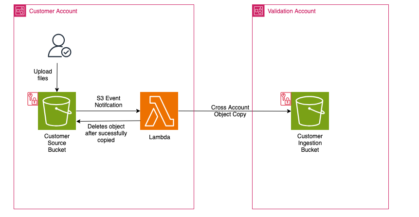

# Bucket to Bucket Ingestion Runbook

This CloudFormation template creates a secure cross-account file transfer system centered around an S3 bucket with KMS encryption. When files are uploaded to the source bucket, a Lambda function automatically copies them to a destination bucket in the Validation AWS account, with optional deletion of source files after successful transfer. The infrastructure includes comprehensive security controls such as KMS encryption for both storage and function execution, TLS-only access enforcement, IAM roles with least privilege permissions, and lifecycle policies for automated object expiration. The system provides detailed logging through CloudWatch and includes error handling for operational monitoring, making it suitable for secure, automated file transfer requirements between AWS accounts.

## Architecture Diagram

## Prerequisites

1. Deploy the Validation Stacks And Diode Stack in their respective AWS accounts.

## Deployment Steps

This is a three step deployment process:

1. The Ingestion Bucket Stack is deployed in the Validation account and needed parameters passed to the customer
2. The Customer Source Bucket Stack is deployed in the Customer account and Lambda Role ARN passed back to the Validation account
3. The Ingestion Bucket Stack is updated in the Validation account with the Lambda Role ARN to grant Lambda role access to KMS Key

### Step 1: Deploy Ingestion Bucket Stack in Validation Account

1. Log into the Validation Account
2. Navigate to the CloudFormation console
3. Click Create stack
4. Select Upload a template file
5. Upload the "aftac_ingestion_bucket.yaml"
6. Click Next
7. Enter a Stack Name
8. Provide the following parameters:
   1. General Parameters:
      - IAM Prefix
      - Resource Suffix (Must match resource suffix used in the main stack)
   2. Tags:
      - [Conditional] Mapping ID
      - [Conditional] Destination Bucket Name
      - Data Owner
      - Data Steward
      - GOV POC
      - Key Owner
   3. [Optional] Encryption Key Alias:
      - Key Alias
   4. [Optional] Bucket Policy Configuration:
      - Allowed Role ARN from Customer Account
   5. [Optional] SFTP Parameters:
      - SFTP User Name
      - SSH Public Keys
   6. Bucket LifeCycle Configuration:
      - Object Expiration in Days
9. Click Next
10. Under the Capabilities section, check the acknowledgment box
11. Click Next
12. On the Review and create page, review all the options and click on Submit button to deploy the stack.
13. Once deployed, navigate to the Outputs section of the stack and copy the following values: 1. IngestBucketName 2. SSES3KmsKeyArn
    Note: Provide these parameters along with the "customer-source-bucket-template.yaml" file to the customer for deployment.

## Step 2: Customer Deploys Customer-Source-Bucket-template in their Account

1. Customer logs into their AWS Account
2. Navigate to the CloudFormation console
3. Click Create stack
4. Select Upload a template file
5. Upload the "customer-source-bucket-template.yaml"
6. Click Next
7. Enter a Stack Name
8. Provide the following parameters:
   1. Source Bucket Configuration Parameters:
      - SourceBucketName
      - ObjectExpirationInDays
      - DeleteSourceObjects
   2. Destination Bucket Configuration Parameters:
      - DestinationBucketName (parameter provided to them)
      - DestinationBucketKeyArn (parameter provided to them)
9. Click Next
10. Under the Capabilities section, check the acknowledgment box
11. Click Next
12. On the Review and create page, review all the options and click on Submit button to deploy the stack.
13. Once deployed, navigate to the Outputs section of the stack and copy the following values: 1. LambdFunctionRoleArn
    Note: the parameter copied above is passed back to Diode Pipeline Administrator.

### Step 3: Update the Ingestion Bucket Stack in Validation Account

1. Log into the Validation Account
2. Navigate to the CloudFormation console
3. Click Ingestion Bucket stack name created in Step 1
4. Click Update
5. Under Update stack, click use existing template
6. Click Next
7. Navigate to the Bucket Policy Configuration Parameter
8. Paste in the Lambda Role ARN received from the customer
9. Click Next and Next
10. On the Review and create page, review all the options and click on Submit button to update the stack.

## License.

© 2025 Amazon Web Services, Inc. or its affiliates. All Rights Reserved.
This AWS Content is provided subject to the terms of the AWS Customer
Agreement available at http://aws.amazon.com/agreement or other written
agreement between Customer and either Amazon Web Services, Inc. or Amazon
Web Services EMEA SARL or both
