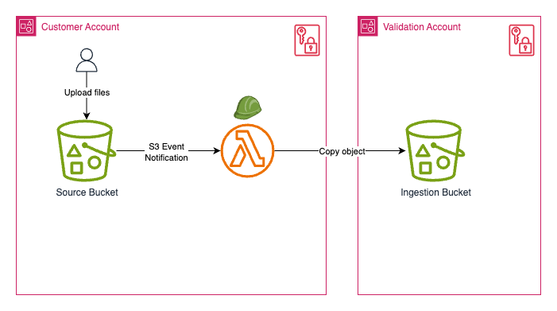

# Customer Account - Source Bucket Infrastructure

This directory contains the CloudFormation template for deploying the customer-side infrastructure of the cross-account diode workstream. The Customer Account serves as the secure entry point for data into the validation and transfer pipeline.

## Overview

The Customer Account infrastructure creates a secure S3 bucket where customers can upload files that need to be transferred across security domains. When files are uploaded, they are automatically copied to the Validation Account for security scanning and processing.

## Architecture

## Prerequisites

Before deploying this template, ensure you have:

1. **IAM Permissions**: Ability to create all the resources defined in the template, such as IAM roles, KMS keys, S3 buckets, and Lambda functions
2. **Validation Account Information**:
   - Ingestion bucket name from the Validation Account
   - KMS key ARN for the ingestion bucket encryption

## Deployment Steps

### Customer Account

#### Step 1: Access CloudFormation Console

1. Log into the AWS Management Console
2. Navigate to **CloudFormation** service
3. Select the appropriate region for deployment

#### Step 2: Create Stack

1. Click **Create stack** → **With new resources (standard)**
2. Under **Template source**, select **Upload a template file**
3. Click **Choose file** and select `customer-source-bucket-stack.yaml`
4. Click **Next**

#### Step 3: Configure Stack Parameters

1. **Stack name**: Enter a descriptive name (e.g., `customer-source-bucket-stack`)
2. **Source Configuration**:
   - **Source Bucket Name**: Enter a unique bucket name (e.g. `my-company-diode-source-2024`)
   - **Delete Source Objects**: Choose whether to delete files after copy (default: false)
   - **Object Retention**: Set retention period (default: 1 day)
3. **Destination Configuration**:
   - **Ingestion Bucket Name**: Enter the ingestion bucket name from Validation Account
   - **Ingestion Bucket KMS Key ARN**: Enter the KMS key ARN for the ingestion bucket from Validation Account
4. Click **Next**

#### Step 4: Configure Stack Options

1. **Tags** (Optional): Add tags for resource management
2. **Permissions**: Leave default (use current role)
3. **Stack failure options**: Leave defaults
4. **Additional settings**: Leave defaults unless specific requirements
5. **Capabilities**: Acknowledge that AWS CloudFormation might create IAM resources.
6. Click **Next**

#### Step 5: Review and Deploy

1. Review all parameters and configuration
2. Click **Submit**

#### Step 6: Monitor Deployment

1. Watch the **Events** tab for deployment progress
2. Deployment typically takes around 3 minutes
3. Status will change to **CREATE_COMPLETE** when finished
4. Go to **Outputs** tab, retrieve the value for `LambdaFunctionRoleArn`, and pass it to the Validation Account owner

### Validation Account

#### Step 1: Access CloudFormation Console

1. Log into the AWS Management Console
2. Navigate to **CloudFormation** service
3. Select the appropriate region for deployment

#### Step 2: Update Ingestion Bucket Stack

1. Find and click on the ingestion bucket stack for the customer
2. Click **Update stack** → **Make a direct update**
3. Click **Next** to use the existing template
4. Paste the `LambdaFunctionRoleArn` from above in the `Allowed Role ARN from Customer Account` parameter
5. Click **Next** twice
6. Click **Submit** to update the stack
7. When the update is complete, the customer will be able to upload files for cross-domain transfer

## Security Considerations

### 1. Access Control

- Source bucket blocks all public access
- Lambda function uses least-privilege IAM role
- Cross-account access limited to specific destination (ingestion) bucket

### 2. Encryption

- All data encrypted at rest using customer-managed KMS keys
- Data encrypted in transit using TLS
- Lambda function environment encrypted

### 3. Monitoring

- CloudWatch Logs capture all Lambda execution details
- CloudTrail logs all API calls for audit purposes
- S3 access logging can be enabled for additional monitoring

## Troubleshooting

### Common Issues

#### 1. Permission Denied Errors

**Symptom**: Lambda function fails with access denied
**Solution**:

- Verify ingestion bucket name and KMS key ARN are correct
- Ensure Validation Account has granted cross-account permissions
- Check IAM role policies in CloudFormation template

#### 2. Bucket Name Already Exists

**Symptom**: Stack creation fails with bucket name conflict
**Solution**:

- S3 bucket names must be globally unique
- Choose a more specific bucket name

#### 3. Lambda Function Timeout

**Symptom**: Large file transfers fail with timeout
**Solution**:

- Current timeout is 15 minutes (maximum for Lambda)
- For larger files, consider using S3 Transfer Acceleration
- Monitor CloudWatch metrics for execution duration

### Debugging

- Check Lambda function configuration
- View recent Lambda errors in the log group for the Lambda function
- Check S3 bucket policy
- Verify KMS key permissions

## Cleanup

To remove all resources created by this template:

### Console Method

1. Go to CloudFormation console
2. Select your stack
3. Click **Delete**
4. Confirm deletion

**Note**: If the S3 bucket contains objects, you must empty it before stack deletion

## Integration with Validation Account

This Customer Account infrastructure integrates with the Validation Account through:

1. **Cross-Account S3 Access**: Lambda function copies files to an ingestion bucket in Validation Account
2. **KMS Key Sharing**: Uses Validation Account's KMS key for destination encryption

Ensure the Validation Account infrastructure is deployed first and provides the necessary:

- Ingestion bucket name
- KMS key ARN for ingestion bucket encryption

## Support and Maintenance

### Regular Maintenance Tasks

1. **Monitor CloudWatch Logs**: Review Lambda execution logs weekly
2. **Check S3 Metrics**: Monitor upload patterns and storage usage
3. **Review IAM Permissions**: Audit cross-account access quarterly
4. **Update Lambda Runtime**: Keep Python runtime version current

### Performance Optimization

- Monitor Lambda duration and memory usage
- Consider S3 Transfer Acceleration for large files
- Implement S3 Intelligent Tiering for cost optimization

For additional support, refer to the main cross-account README or contact the infrastructure team.
