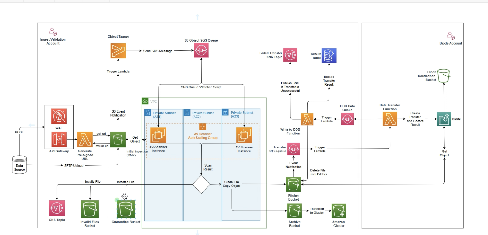

# Diode Low to High Pipeline Deployment Runbook

## Architecture Diagram

## Solution Overview

The diode low-to-high pipeline, implemented through Infrastructure as Code, provides a secure and automated system for transferring data between security domains. The architecture is structured into three distinct components that work in sequence to ensure secure and validated data transfer.

1. The Data Ingestion component serves as the pipeline's front end, offering multiple entry points for data uploads. Users can upload data through a presigned URL using API Gateway, SFTP Server, or through bucket-to-bucket transfer via S3. When data arrives in the Ingestion bucket, an S3 event notification triggers the Object Tagger Function, which then queues the data in the AV Scan Queue for initial processing.

2. The Data Validation component employs an SQS poller service running on auto-scaled EC2 instances to process the queued data. This service validates each file to ensure it is both clean (virus-free) and of an acceptable file type. The validation process routes files to different destinations based on their status: invalid files are archived in the Invalid-Files-Bucket, infected files are quarantined in the Quarantine-Bucket, and clean, valid files proceed to the Data-Transfer-Bucket for final processing.

3. The Data Transfer component completes the pipeline by managing the actual transfer to the high-side destination. When validated files arrive in the Data-Transfer-Bucket, they trigger S3 event notifications that activate the Data Transfer Lambda Function. This function initiates transfer API calls to the Diode service, using object tags to determine the appropriate Mapping ID and destination. The Lambda function records all transfer results in DynamoDB and, upon successful transfer, removes the files from the Data-Transfer-Bucket. Any transfer failures trigger notifications through the Failed SNS Notification Topic and those failed transfers are sent to the FailedTransfer-Bucket, ensuring comprehensive monitoring and error handling throughout the process.

## Prerequisites

1. Two AWS accounts are required to deploy the solution
   1. Validation Account for deploying the Logging, Ingestion, Pipeline, SFTP and ImageBuilder Stacks.
   2. Diode Account for deploying the Diode Transfer Stack.
2. In the Validation Account, ensure there is a VPC created with the following:
   1. Two Public Subnets (for SFTP)
   2. Three Private Subnets
   3. Access to the Internet via a Proxy Server
3. In the Diode Account, set up Diode Mapping between the Diode Account and an High Side Account.
4. Ensure when deploying the solution you have the proper permissions (ex. PROJADMIN) and not blocked by either permission boundary or service control policies.
5. Have an AMI with ClamAv installed
6. Set up API Gateway logging to CloudWatch logs (https://docs.aws.amazon.com/apigateway/latest/developerguide/set-up-logging.html#set-up-access-logging-permissions)
7. Clone the diode workstream repository to your local computer

## Deployment Steps

### VALIDATION ACCOUNT

### A. Create S3 bucket to store deployment stacks

#### Steps

1. Log into the Validation account
2. Navigate to S3 console
3. Create an S3 Bucket
4. Create a folder (ex templates)
5. From your cloned repo, upload the files within the validation-account folder into the folder within this deployment bucket

### A. Deploy the Required Resources Stacks

This CloudFormation template creates a set of VPC endpoints in a specified VPC, enabling private, secure communication between resources in the VPC and various AWS services without traversing the public internet. It sets up gateway endpoints for S3 and DynamoDB and interface endpoints for services like SSM, EC2 Messages, SQS, CloudWatch Logs, SNS, and EC2 Image Builder.

#### Steps

1. Log into the Validation account
2. Navigate to S3 console
3. Navigate to the S3 bucket created in step above
4. Navigate to the templates folder
5. Look for "aftac_required_resources.yaml" file
6. Copy the URL for the "aftac_required_resources.yaml" file
7. Navigate to CloudFormation console
8. Click Create stack
9. Choose an existing template
10. Paste the S3 URL copied in the URL box
11. Click Next
12. Enter a Stack Name
13. Provide the following parameters:
    - VPC ID
    - VPC CIDR
    - Private Subnet IDs
    - Private Route Table IDs
14. Click Next
15. Under the Capabilities section, check the acknowledgment box
16. Click Next
17. On the Review and create page, review all the options and click on Submit button to deploy the stack.

### B. Deploy the Validation Account Stacks

#### Important Note: When creating the stacks, ensure that the Resource-Prefix parameter is the same across the Validation Account and Diode Account for the pipeline to work correctly.

- Main stack - This CloudFormation template serves as the main orchestrator for a secure file transfer and validation solution, consisting of four nested stacks: logging for centralized logging infrastructure, ingest for initial file handling, pipeline for file validation and cross-domain transfer, and SFTP server for secure file uploads.

- Logging stack - This CloudFormation template creates a secure S3 bucket infrastructure for access logging with associated KMS encryption. The template sets up an S3 bucket with a lifecycle policy that automatically transitions objects through different storage classes (from standard to Glacier Instant Retrieval, and then to Deep Archive) based on configurable time periods, and eventually expires them. The bucket is configured with versioning, server-side encryption using KMS, and object lock enabled. Security features include a bucket policy that enforces TLS 1.2, denies non-HTTPS access, and restricts access to only S3 logging services. The KMS key is configured with a detailed policy allowing specific AWS services (S3, SNS, Lambda, CloudWatch) to use it while maintaining strict access controls. The template exports the bucket name and KMS key ARN for use in other stacks.

- Ingest Stack - This CloudFormation template creates a secure, monitored file upload infrastructure that combines API Gateway, Lambda functions, and WAF protection. The system handles file uploads through presigned URLs, processes object tagging, and manages anti-virus scanning through auto-scaled EC2 instances running ClamAV. It implements comprehensive security measures including WAF rules against common attacks, IAM authentication, VPC integration, and encryption. The template also sets up extensive monitoring with CloudWatch dashboards, metrics, and anomaly detection alarms that track request patterns, blocking ratios, and potential security incidents by IP, country, and URI. All components follow AWS security best practices and include proper error handling through dead letter queues and logging mechanisms.

- Pipeline Stack - This CloudFormation template creates a comprehensive data validation and transfer pipeline infrastructure. It sets up multiple S3 buckets (for quarantine, invalid files, failed transfers, and data transfer), with appropriate lifecycle policies and encryption. The template includes an Auto Scaling Group of EC2 instances for virus scanning, Lambda functions for processing transfer results, and SQS queues for message handling. Security features include KMS encryption, IAM roles with least privilege, VPC networking with security groups, and S3 bucket policies. The infrastructure also includes monitoring through CloudWatch alarms, SNS notifications for various events (infected files, invalid files, failed transfers), and DynamoDB for tracking transfer status. The system supports integration with a data diode for secure cross-domain transfers and includes SSM parameters for configuration management.

- Sftp Stack - This CloudFormation template creates a secure SFTP server infrastructure using AWS Transfer Family, configured with VPC integration and enhanced security controls. It sets up a highly available SFTP endpoint across multiple subnets with Elastic IPs, implements service-managed authentication, and includes comprehensive logging to CloudWatch with a 2-year retention period. The template establishes necessary IAM roles with least-privilege permissions for both logging and user access, configures a security group that restricts SSH access to specified CIDR blocks, and implements the latest Transfer Family security policy. All components are designed with security best practices in mind, including permissions boundaries, restricted egress rules, and structured logging capabilities.

#### Steps

1. Log into the Validation account
2. Navigate to S3 console
3. Navigate to the S3 bucket created in step above
4. Navigate to the templates folder
5. Look for "aftac_main_stack.yaml" file
6. Copy the URL for the "aftac_main_stack.yaml" file
7. Navigate to CloudFormation console
8. Click Create stack
9. Choose an existing template
10. Paste the S3 URL copied in the URL box
11. Click Next
12. Enter a Stack Name (ex. Main Stack)
13. Provide the following parameters:
    1. General Parameters:
       - IAM Prefix
       - Permission Boundary Policy Arn
       - Resource Suffix (Value used here must also be used everywhere where the resource suffix parameter is required)
    2. Template Location Parameters:
       - Template S3 Bucket Name
       - Template S3 Prefix
    3. Networking Parameters:
       - VPC ID
       - VPC CIDR
       - Private Subnet IDs
       - S3 Prefix List ID
       - DynamoDB Prefix List ID
    4. Pipeline Stack Parameters:
       - Pipeline Stack Diode Account ID
       - Pipeline Stack Pipeline AMI ID
       - Approved File Types
       - DFDL Approved File Types
    5. SSM Agent Update Configuration Parameters:
       - SSM Agent update Interval
       - Max Concurrency
       - Max Errors
    6. SFTP Stack Parameters:
       - SFTP Server Private Subnet IDs
       - SFTP Server Stack Ingress Rule CIDR
    7. Bucket LifeCycle Configuration Parameters:
       - Object Transition To Glacier_IR
       - Object Transition To Deep Archive
       - Object Expiration In Days For Failed Transfer Bucket
       - Object Expiration In Days For Data Transfer Bucket
       - Object Expiration In Days For Invalid Files Bucket
       - Object Expiration In Days For Access Log Bucket
14. Click Next
15. Under the Capabilities section, check the acknowledgment box
16. Click Next
17. On the Review and create page, review all the options and click on Submit button to deploy the stack.

### C. Deploy Image Builder Stack

This CloudFormation template creates an EC2 Image Builder pipeline infrastructure for automating the creation and maintenance of Amazon Machine Images (AMIs). The template sets up multiple components including an image recipe, infrastructure configuration, distribution configuration, and associated IAM roles and security groups. It also includes Lambda functions for triggering image pipeline updates when new source AMIs become available and for refreshing Auto Scaling Groups when new images are created.

#### Steps

1. Log into the Validation account
2. Navigate to S3 console
3. Navigate to the S3 bucket created in step above
4. Navigate to the templates folder
5. Look for "aftac_image_builder_stack.yaml" file
6. Copy the URL for the "aftac_image_builder_stack.yaml" file
7. Navigate to CloudFormation console
8. Click Create stack
9. Choose an existing template
10. Paste the S3 URL copied in the URL box
11. Click Next
12. Enter a Stack Name
13. Provide the following parameters:
    1. General Parameters:
       - IAM Prefix
       - Permission Boundary Policy Arn
       - Resource Suffix (Must match resource suffix used in the main stack)
       - Anti-Virus Scan Mode
       - Proxy Server Address
       - Email Notification
    2. Template Location Parameters:
       - Template S3 Bucket Name
       - Template S3 Prefix
    3. Image Builder Parameters:
       - Semantic Version
       - Parent Image
       - Source Account ID
       - Image Name Pattern
       - Required Image Description Pattern
       - Image Check Frequency
       - Bypass GPG Check
       - VPC ID
       - Subnet ID
       - Outbound CIDR
    4. Click Next
    5. Under the Capabilities section, check the acknowledgment box
    6. Click Next
    7. On the Review and create page, review all the options and click on Submit button to deploy the stack.

### D: Deploy Ingestion Bucket Stack

This CloudFormation template creates a secure S3 ingestion bucket infrastructure with robust security controls and optional features. It configures the bucket with KMS encryption, access logging, lifecycle rules, and public access blocking. The template allows for customization through parameters, including required tags, optional KMS key alias, external role access, and SFTP user setup.

#### Steps

1. Log into the Validation account
2. Navigate to S3 console
3. Navigate to the S3 bucket created in step above
4. Navigate to the templates folder
5. Look for "aftac_ingestion_bucket.yaml" file
6. Copy the URL for the "aftac_ingestion_bucket.yaml" file
7. Navigate to CloudFormation console
8. Click Create stack
9. Choose an existing template
10. Paste the S3 URL copied in the URL box
11. Click Next
12. Enter a Stack Name
13. Provide the following parameters:
    1. General Parameters:
       - IAM Prefix
       - Resource Suffix (Must match resource suffix used in the main stack)
    2. Tags:
       - [Conditional] Mapping ID
       - [Conditional] Destination Bucket Name
       - Data Owner
       - Data Steward
       - GOV POC
       - Key Owner
    3. [Optional] Encryption Key Alias:
       - Key Alias
    4. [Optional] Bucket Policy Configuration:
       - Allowed Role ARN from Customer Account
    5. [Optional] SFTP Parameters:
       - SFTP User Name
       - SSH Public Keys
    6. Bucket LifeCycle Configuration:
       - Object Expiration in Days
14. Click Next
15. Under the Capabilities section, check the acknowledgment box
16. Click Next
17. On the Review and create page, review all the options and click on Submit button to deploy the stack.

### DIODE ACCOUNT

### E. Deploy Diode Data Transfer Stack (In the Diode Account)

This CloudFormation template sets up a data transfer infrastructure that handles file transfers using the Diode service. The template creates a Lambda function that processes transfer requests from an SQS queue, manages the actual data transfer, and reports results back through another SQS queue. The infrastructure includes proper IAM roles and permissions, CloudWatch logging, error handling with a Dead Letter Queue, and EventBridge rules to track transfer status. The template is parameterized to allow configuration of security settings (like IAM prefixes and permission boundaries), resource naming, and integration points with external systems (like S3 buckets and SQS queues in the validation account). Security features include KMS encryption, strict IAM roles, and proper cross-account access controls.

#### Steps

1. Log into the Diode account
2. Navigate to S3 console
3. Create a deployment S3 Bucket
4. Once created, click on the bucket name and open the properties tab
5. Navigate to the Bucket Versioning section and click Edit
6. Click on Enable and Save changes
7. From your cloned repo, upload the files within the diode-account folder into the deployment bucket
8. Navigate back to file uploaded in the previous step and click show version
9. Copy the version id into you clipboard for future use.
10. [Optional] If currently have a null version id, re-upload the same file into the bucket to get a version id
11. Navigate back to your deployment bucket
12. Copy the URL for the "diode_account_stack.yaml"
13. Navigate to CloudFormation console
14. Click Create stack
15. Choose an existing template
16. Paste the S3 URL copied in the URL box
17. Click Next
18. Enter a Stack Name (ex. Diode account stack)
19. Provide the following parameters:
    1. General Parameters:
       - IAM Prefix
       - Permission Boundary Policy Arn
       - Resource Suffix (Must match resource suffix used in the main stack)
    2. Resources From Validation Account Parameters: (These parameter values can found in the Outputs section of the Main stack in the Validation Account)
       - Data Transfer Bucket Name
       - Data Transfer SQS Queue ARN
       - Data Transfer Result SQS Queue ARN
       - Pipeline KMS Key ARN
    3. Data Transfer Lambda Code Parameters:
       - Data Transfer Lambda Storage Bucket (The deployment bucket name created in step 3)
       - Data Transfer Lambda Code Key Version (The version id coiped in step 9)
    4. Diode Simulator Parameters:
       - Use Diode Simulator (select False)
       - Diode Simulator Endpoint (Leave this blank)
    5. Click Next
    6. Under the Capabilities section, check the acknowledgment box
    7. Click Next
    8. On the Review and create page, review all the options and click on Submit button to deploy the stack.

This completes the deployment of Diode Low to High Pipeline solution.

## License.

© 2025 Amazon Web Services, Inc. or its affiliates. All Rights Reserved.
This AWS Content is provided subject to the terms of the AWS Customer
Agreement available at http://aws.amazon.com/agreement or other written
agreement between Customer and either Amazon Web Services, Inc. or Amazon
Web Services EMEA SARL or both
