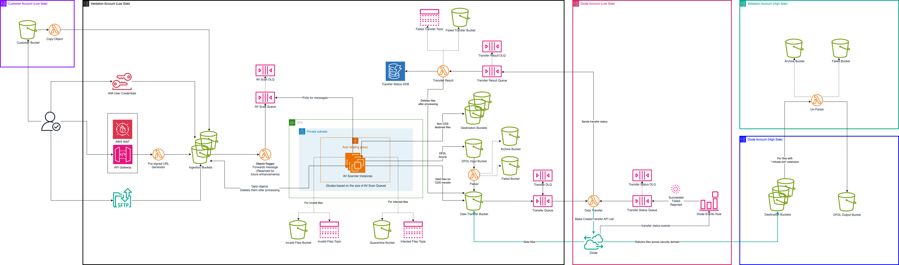

# Low-to-High Pipeline Deployment

## Architecture Diagram



## Solution Overview

The low-to-high pipeline, implemented through Infrastructure as Code, provides a secure and automated system for transferring data between security domains. Below is the general workflow:

1. Users securely upload data through one of the four ingestion mechanisms: SFTP (Secure File Transfer Protocol) servers, pre-signed URLs generated through API Gateway, direct uploads using IAM user credentials, and automated bucket-to-bucket transfers for system-to-system interactions. When data arrives in an ingestion bucket, an S3 event notification triggers a Lambda function (previously known as Object Tagger) that forwards a message to the AV Scan SQS queue. This message notifies the system that new data is available for processing, initiating the pipeline workflow.

2. The system utilizes auto-scaled EC2 instances running a service that continuously polls the AV Scan SQS queue. Upon receiving a message, the service performs two key validations on each referenced file: verifying the file type against an allow list and scanning for viruses. Based on these validation results, files are routed to different buckets: invalid files go to the Invalid Files bucket, infected files to the Quarantine bucket, and clean valid files follow one of three paths. Files not marked for cross-domain transfer move directly to a destination bucket, those tagged for Daffodil processing are sent to the DFLD Input bucket before moving to the Data Transfer bucket, while all other clean files are routed directly to the Data Transfer bucket.

3. When validated files arrive in the Data Transfer bucket, S3 event notifications send messages to the Transfer SQS queue. These messages are then processed by the Data Transfer Lambda function in the Diode account. This function initiates transfer API calls to the Diode service, using object tags to determine the appropriate Mapping ID and destination. All transfer results are captured via the Transfer Status SQS queue and forwarded to the Transfer Result SQS queue in the validation account. The Transfer Result Lambda function processes these messages, recording transfer statuses in DynamoDB and removing files from the Data Transfer bucket. For failed transfers, the function sends notifications and moves the affected files to the Failed Transfer bucket.

## Prerequisites

1. Repository cloned with all solution files, including CloudFormation templates
2. The solution requires four AWS accounts:
   1. Validation Account (Low-side):
      1. IAM permissions to create all resources defined in the solution's CloudFormation templates
      2. Existing VPC with:
         1. At least two public subnets across different AZs (for SFTP endpoints)
         2. At least two private subnets across different AZs, each with:
            - S3 Gateway endpoint routing configured
            - Internet access via proxy server
      3. AMI with ClamAv installed
   2. Diode Account (Low-side):
      1. IAM permissions to create all resources defined in the solution's CloudFormation templates
      2. Diode mapping established between this account and a high-side account
   3. Validation Account (High-side):
      1. IAM permissions to create all resources defined in the solution's CloudFormation templates
      2. Existing VPC with at least two private subnets across different AZs, each with:
         - S3 Gateway endpoint routing configured
         - Internet access via proxy server
   4. Diode Account (High-side):
      1. IAM permissions to create all resources defined in the solution's CloudFormation templates

## Deployment Steps

### Validation Account (Low Side)

#### 1. Set up API Gateway logging

First, check if logging is already configured:

1. Navigate to API Gateway console and click `Settings` in the left navigation pane.
2. If you see a value in `CloudWatch log role ARN`, you can either skip to the next section or continue with the rest of the steps to replace the value.

If logging needs to be configured, create an IAM role:

1. Navigate to IAM console and click `Roles` in the left navigation pane.
2. Click `Create role` on the top right.
3. With `Trusted entity type` set to `AWS service`, select `API Gateway` in the dropdown.
4. Click `Next`.
5. (Optional) Set permissions boundary with a required policy.
6. Click `Next`.
7. Give it a sensible role name (e.g., "API-Gateway-CloudWatch-Logs-Role"), adding any required prefix(es).
8. Click `Create role`.
9. Copy the role ARN.

Configure the logging with the new role:

1. Navigate back to API Gateway console and click `Settings` in the left navigation pane.
2. Click `Edit`.
3. Paste in the role ARN.
4. Click `Save changes`.

_For additional info_: https://docs.aws.amazon.com/apigateway/latest/developerguide/set-up-logging.html#set-up-access-logging-permissions

#### 2. Upload assets to S3 bucket in Validation Account (Low-side)

1. Navigate to S3 console.
2. Select an existing bucket (or [create a new one](https://docs.aws.amazon.com/AmazonS3/latest/userguide/create-bucket-overview.html)).
3. Enable [versioning](https://docs.aws.amazon.com/AmazonS3/latest/userguide/Versioning.html) on the bucket, if not already enabled.
4. Click `Upload`.
5. Click `Add folder`.
6. Select the `validation-account` folder from your cloned repository.
7. Click `Upload`.

#### 3. Set up required resources

The solution requires a set of VPC endpoints to enable private, secure communication between resources in VPC and AWS services without internet access. This includes a gateway endpoint for DynamoDB and interface endpoints for AutoScaling, EC2 Messages, ImageBuilder, CloudWatch Logs, SNS, SQS, SSM Messages, and SSM. A dedicated security group is created and attached to all interface endpoints to control access.

1. Navigate to S3 console.
2. Locate the `aftac_required_resources.yaml` template that was uploaded to the S3 bucket [above](#2-upload-assets-to-s3-bucket-in-validation-account-low-side).
3. Select the template and click `Copy URL`.
4. Navigate to CloudFormation console.
5. Click `Stacks` in the left navigation pane.
6. Click `Create stack` and select `With new resources (standard)`.
7. Paste the S3 URL copied earlier in `Amazon S3 URL`.
8. Click `Next`.
9. Enter a sensible name for the stack.
10. Provide values for the following parameters:
    - VPC ID
    - VPC CIDR
    - Private Subnet IDs
    - Private Route Table IDs
11. Click `Next`.
12. Click `Next`.
13. Click `Submit`.
14. Wait for stack creation to complete (status: `CREATE_COMPLETE`).

_(**Note**: Deploy this only once when using multiple validation pipelines within the same VPC.)_

#### 4. Deploy the main resources

Main resources are deployed through an orchestration stack that manages four specialized nested stacks. The logging infrastructure establishes a KMS-encrypted S3 bucket with comprehensive lifecycle management and security controls. The ingestion layer handles file uploads through API Gateway and Lambda functions, protected by WAF and monitored via CloudWatch anomaly detection. The core processing pipeline manages file validation and transfers using multiple purpose-specific S3 buckets, auto-scaled EC2 instances for file validation and virus scanning, and DynamoDB for status tracking, with comprehensive error handling and notifications. The SFTP infrastructure provides secure file transfer capabilities using AWS Transfer Family, featuring high availability with dual Elastic IPs, VPC integration, and strict access controls.

1. Navigate to S3 console.
2. Locate the `aftac_main_stack.yaml` template that was uploaded to the S3 bucket [above](#2-upload-assets-to-s3-bucket-in-validation-account-low-side).
3. Select the template and click `Copy URL`.
4. Navigate to CloudFormation console.
5. Click `Stacks` in the left navigation pane.
6. Click `Create stack` and select `With new resources (standard)`.
7. Paste the S3 URL copied earlier in `Amazon S3 URL`.
8. Click `Next`.
9. Enter a sensible name for the stack.
10. Provide values for the following parameters:
    1. General:
       - IAM Prefix
       - Permissions Boundary Policy ARN
       - **Resource Suffix**: This value _**MUST**_ match across all related stacks to ensure proper resource and pipeline integration.
    2. Template Location:
       - Template Bucket Name: Enter the name of the S3 bucket [above](#2-upload-assets-to-s3-bucket-in-validation-account-low-side).
       - Template Prefix
    3. Networking:
       - VPC ID
       - VPC CIDR
       - Private Subnet IDs
       - S3 Prefix List ID: Follow the instructions in the [AWS documentation](https://docs.aws.amazon.com/vpc/latest/userguide/working-with-aws-managed-prefix-lists.html#available-aws-managed-prefix-lists) to find this value in the console.
       - DynamoDB Prefix List ID: Follow the instructions in the [AWS documentation](https://docs.aws.amazon.com/vpc/latest/userguide/working-with-aws-managed-prefix-lists.html#available-aws-managed-prefix-lists) to find this value in the console.
    4. Pipeline:
       - Diode Account ID
       - Image ID
       - DFDL Approved File Types
       - Exempt File Types
       - Email End Point
       - Diode Simulator Instance Role
    5. SFTP:
       - SFTP Server Subnet IDs
       - SFTP Server Ingress Rule CIDR
    6. SSM Agent Update Configuration:
       - SSM Agent update Interval: _Note that the default value might not work on the high side._
       - Max Concurrency
       - Max Errors
    7. Bucket LifeCycle Configuration:
       - Object Transition To Glacier IR
       - Object Transition To Deep Archive
       - Object Expiration In Days For Failed Transfer Bucket
       - Object Expiration In Days For Data Transfer Bucket
       - Object Expiration In Days For Dfdl Input Bucket
       - Object Expiration In Days For Invalid Files Bucket
       - Object Expiration In Days For Access Log Bucket
11. Click `Next`.
12. (Optional) Under `Behavior on provisioning failure`, check `Preserve successfully provisioned resources` to prevent a rollback (and subsequent deletion) in case of a failure. This can save overall deployment time and help with troubleshooting. Note that it should be set to `Roll back all stack resources` after the initial stack creation; otherwise, stack updates can fail. Refer to the [AWS documentation](https://docs.aws.amazon.com/AWSCloudFormation/latest/UserGuide/stack-failure-options.html) for more info.
13. Under `Capabilities`, check the acknowledgment box(es).
14. Click `Next`.
15. Click `Submit`.
16. Wait for stack creation to complete for the main stack (status: `CREATE_COMPLETE`).

#### 5. Deploy Daffodil pipeline

The solution allows integration of [Apache Daffodil](https://daffodil.apache.org/) to create a serverless data processing pipeline that automatically validates and transforms files using DFDL (Data Format Description Language) schemas. The architecture leverages two Java-based Lambda functions: a precompiler that optimizes DFDL schemas for performance, and a parser that handles file processing and transformation. The parser function, which also serves as an un-parser for reverse transformations, automatically triggers when files are uploaded to the input bucket on the high side. It validates data structures, transforms successful files to the output bucket with optional archiving, redirects failed files to a dead-letter bucket, and sends error notifications via SNS, creating a comprehensive bidirectional workflow with robust error handling.

Schema management is handled through a dedicated S3 schema bucket that stores both DFDL schemas and a `content-types.yaml` mapping file, with example schemas and mappings available in `daffodil/test_resources/schemas`. The parser determines which schema to use based on the filename, searching through filename segments (separated by periods) and selecting the first segment that matches a key in the content-types mapping. For instance, with a file named `UNCLASS.USNDC.INTERVAL.da_interval_1709659229.txt`, the parser would use the schema mapping for `INTERVAL` if it exists in the mapping while `UNCLASS` and `USNDC` do not.

To optimize performance, the system implements two-level caching. The content-types mapping, derived from the `content-types.yaml` file, is cached with a default one-minute TTL, configurable via the `CONTENT_TYPE_CACHE_TTL_MINUTES` environment variable. Additionally, the data parser retrieval and schema compilation (if not precompiled) are cached with a default 15-minute TTL, adjustable through the `DATA_PROCESSOR_CACHE_TTL_MINUTES` environment variable, ensuring efficient resource utilization while maintaining system responsiveness.

Create the infrastructure:

1. Navigate to S3 console.
2. Locate the `aftac_dfdl_stack.yaml` template that was uploaded to the S3 bucket [above](#2-upload-assets-to-s3-bucket-in-validation-account-low-side).
3. Select the template and click `Copy URL`.
4. Navigate to CloudFormation console.
5. Click `Stacks` in the left navigation pane.
6. Click `Create stack` and select `With new resources (standard)`.
7. Paste the S3 URL copied earlier in `Amazon S3 URL`.
8. Click `Next`.
9. Enter a sensible name for the stack.
10. Provide values for the following parameters:
    1. General:
       - IAM Prefix
       - Permissions Boundary Policy ARN
       - **Resource Suffix**: Enter the **SAME** value used [above](#4-deploy-the-main-resources)
    2. Lambda Code Storage Configuration:
       - Lambda Code Storage Bucket Name: Enter the name of the S3 bucket [above](#2-upload-assets-to-s3-bucket-in-validation-account-low-side)
       - Parser Lambda Key: Enter the S3 object key for `parser.jar` in the S3 bucket [above](#2-upload-assets-to-s3-bucket-in-validation-account-low-side) ([Learn about object keys](https://docs.aws.amazon.com/AmazonS3/latest/userguide/object-keys.html)).
       - Parser Lambda Key Version ID: Enter the S3 object version for `parser.jar` in the S3 bucket [above](#2-upload-assets-to-s3-bucket-in-validation-account-low-side) ([Learn about object versions](https://docs.aws.amazon.com/AmazonS3/latest/userguide/RetrievingObjectVersions.html)).
       - Precompiler Lambda Key: Enter the S3 object key for `precompiler.jar` in the S3 bucket [above](#2-upload-assets-to-s3-bucket-in-validation-account-low-side) ([Learn about object keys](https://docs.aws.amazon.com/AmazonS3/latest/userguide/object-keys.html)).
       - Precompiler Lambda Key Version ID: Enter the S3 object version for `precompiler.jar` in the S3 bucket [above](#2-upload-assets-to-s3-bucket-in-validation-account-low-side) ([Learn about object versions](https://docs.aws.amazon.com/AmazonS3/latest/userguide/RetrievingObjectVersions.html)).
    3. Lambda Networking Configuration:
       - VPC ID
       - Private Subnet IDs
    4. Daffodil Configuration:
       - Input Bucket: From the [main stack](#4-deploy-the-main-resources) Outputs, enter the value for `DfdlInputBucketName`.
       - Output Bucket: From the [main stack](#4-deploy-the-main-resources) Outputs, enter the value for `DataTransferBucketName`.
       - Account ID for Input and Output Buckets: Leave it blank
       - S3 Key Filter Suffix: Leave it blank
       - Archive Successful Files
       - Move Failed Files
       - Error Notification Email
       - Content Types File S3 Key
       - Content Types Cache TTL (Minutes)
       - Data Processors Cache TTL (Minutes)
       - Enable Detailed Performance Metrics
11. Click `Next`.
12. Under `Capabilities`, check the acknowledgment box(es).
13. Click `Next`.
14. Click `Submit`.
15. Wait for stack creation to complete (status: `CREATE_COMPLETE`).

Upload `content-types.yaml` file and schemas to S3 bucket:

1. In the stack Outputs, note the value for `SchemaBucket` key.
2. Create a file named `content-types.yaml`:

   - A sample exists inside `validation-pipeline/daffodil/test_resources/schemas` directory, with a mapping like below:
     ```yaml
     "INTERVAL": "usndc.da.dfdl.xsd"
     "WWLLN": "A202309201610.dfdl.xsd"
     "BRDC": "brdc2620.23n.dfdl.xsd"
     ```
   - Using the mapping above, an object named `abc.wwlln.def.xyz` will use a schema file named `A202309201610.dfdl.xsd` (Note that the second part of the object name, `wwlln`, matches `WWLLN` key case-insensitively).

3. Navigate to S3 console.
4. Click the bucket with the value noted above.
5. Click `Upload`.
6. Click `Add files`.
7. Upload both the `content-types.yaml` file and schema files (`.xsd`) to the bucket's root level.
8. Click `Upload`.

#### 6. Deploy EC2 Image Builder pipeline

The solution uses an EC2 Image Builder pipeline to automate AMI creation and maintenance. The pipeline builds AMIs with required software (Python, AWS CLI, CloudWatch Agent, and other tools) and integrates with Auto Scaling Groups for automated deployments. A Lambda function monitors for new base AMIs and triggers pipeline updates, while the system performs automatic ASG instance refresh when new images are built. Comprehensive notifications are provided via SNS.

Create the infrastructure:

1. Navigate to S3 console.
2. Locate the `aftac_image_builder_stack.yaml` template that was uploaded to the S3 bucket [above](#2-upload-assets-to-s3-bucket-in-validation-account-low-side).
3. Select the template and click `Copy URL`.
4. Navigate to CloudFormation console.
5. Click `Stacks` in the left navigation pane.
6. Click `Create stack` and select `With new resources (standard)`.
7. Paste the S3 URL copied earlier in `Amazon S3 URL`.
8. Click `Next`.
9. Enter a sensible name for the stack.
10. Provide values for the following parameters:
    1. General:
       - IAM Prefix
       - Permissions Boundary Policy ARN
       - **Resource Suffix**: Enter the **SAME** value used [above](#4-deploy-the-main-resources)
    2. Template Location:
       - Template Bucket Name: Enter the name of the S3 bucket [above](#2-upload-assets-to-s3-bucket-in-validation-account-low-side).
       - Template Prefix: Enter the prefix used [above](#2-upload-assets-to-s3-bucket-in-validation-account-low-side).
    3. Networking:
       - VPC ID
       - Subnet ID
       - Outbound CIDR
    4. Image Builder:
       - Semantic Version: Increment the version (e.g. 1.0.0 -> 1.0.1) when making changes to any parameters in this section, except for Email Notification.
       - Parent Image
       - Proxy Server Address
       - No Proxy List
       - Bypass GPG Check
       - Email Notification
    5. Image Builder Auto Update:
       - Image Check Frequency: Leave it blank to disable auto check.
       - Image Name Pattern: Ignored if disabled.
       - Image Description Pattern: Ignored if disabled.
       - Source Account ID: Ignored if disabled.
11. Click `Next`.
12. Under `Capabilities`, check the acknowledgment box(es).
13. Click `Next`.
14. Click `Submit`.
15. Wait for stack creation to complete (status: `CREATE_COMPLETE`).

(On updates) Upload required files and scripts:

The initial creation of the above stack copies all the necessary files and scripts from the template bucket [above](#2-upload-assets-to-s3-bucket-in-validation-account-low-side) to a newly created bucket. For subsequent updates to those files and scripts, however, manual upload may be required.

1.  Navigate to S3 console.
2.  Locate the newly created bucket `image-builder-ec2requiredfilesbucket-xxxxxxxxxxxx`.
3.  Click the bucket name.
4.  Click `Upload`.
5.  Click `Add folder`.
6.  Select the `ec2-files` folder from your cloned repository.
7.  Click `Upload`.

(On the high side) Upload Python wheel files:

As Python package repositories may not be available on the high side, prepare wheel files on the low side and transfer them to the high side:

1. On the low side, run the following commands (e.g., in CloudShell):

   ```
   mkdir wheel
   python -m pip download --only-binary :all: --dest wheel --no-cache pip boto3 puremagic pyjwt
   ```

2. Transfer all the downloaded wheel files from the `wheel` directory to the high side.
3. On the high side, upload those files to S3 bucket:
   1. Navigate to S3 console.
   2. Locate the newly created bucket `image-builder-ec2requiredfilesbucket-xxxxxxxxxxxx`.
   3. Click the bucket name.
   4. Click `Create folder`.
   5. Enter `wheel` in `Folder name`.
   6. Click `Create folder`.
   7. Click `wheel/` folder.
   8. Click `Upload`.
   9. Click `Add files`.
   10. Select all the transferred wheel files.
   11. Click `Upload`.

Produce an image using the pipeline:

1. Navigate to EC2 Image Builder console.
2. Click `Image pipelines` in the left navigation pane.
3. Click the pipeline whose name follows `image-pipeline-${ResourceSuffix}` pattern.
4. Click `Actions` on the top right, then select `Run pipeline`.
5. Refresh the page.
6. Under `Output images`, wait for the latest version's `Image status` to become `Available`.
7. (Optional) Monitor progress or troubleshoot failures by viewing the latest log stream.

#### 7: Create ingestion buckets

The solution uses ingestion buckets to receive files for processing. These buckets integrate with the validation pipeline through S3 event notifications and support multiple upload methods (SFTP, presigned URLs, bucket-to-bucket, and IAM user credential). Specific tags are required to ensure proper routing based on mapping IDs or destination buckets.

1. Navigate to S3 console.
2. Locate the `aftac_ingestion_bucket.yaml` template that was uploaded to the S3 bucket [above](#2-upload-assets-to-s3-bucket-in-validation-account-low-side).
3. Select the template and click `Copy URL`.
4. Navigate to CloudFormation console.
5. Click `Stacks` in the left navigation pane.
6. Click `Create stack` and select `With new resources (standard)`.
7. Paste the S3 URL copied earlier in `Amazon S3 URL`.
8. Click `Next`.
9. Enter a sensible name for the stack.
10. Provide values for the following parameters:
    1. General:
       - IAM Prefix
       - **Resource Suffix**: Enter the **SAME** value used [above](#4-deploy-the-main-resources)
    2. Allowed File Types and MIME Mapping:
       - Approved File Types
       - MIME Mapping
    3. Tags:
       - Mapping ID
       - DFDL Bound
       - Destination Bucket Name
       - Data Owner
       - Data Steward
       - GOV POC
       - Key Owner
       - Ingest Bucket Destination Parameter Mapping Key
    4. Bucket KMS Key:
       - Key Alias
       - IAM Entity Allowed to Use Key: Enter value when using IAM user credentials to upload files
    5. External IAM Entity:
       - Allowed Role ARN from Customer Account: Enter role ARN when using bucket-to-bucket ingestion
    6. Secure File Transfer Protocol (SFTP):
       - SFTP User Name
       - SSH Public Keys
    7. Bucket LifeCycle:
       - Object Expiration in Days
11. Click `Next`.
12. Click `Next`.
13. Click `Submit`.
14. Wait for stack creation to complete (status: `CREATE_COMPLETE`).

### Diode Account (Low Side)

#### 1. Upload assets to S3 bucket in Diode Account (Low-side)

1. Navigate to S3 console.
2. Select an existing bucket (or [create a new one](https://docs.aws.amazon.com/AmazonS3/latest/userguide/create-bucket-overview.html)).
3. Enable [versioning](https://docs.aws.amazon.com/AmazonS3/latest/userguide/Versioning.html) on the bucket, if not already enabled.
4. Click `Upload`.
5. Click `Add folder`.
6. Select the `diode-account` folder from your cloned repository.
7. Click `Upload`.

#### 2. Deploy Diode data transfer stack

The solution requires a Diode data transfer infrastructure stack in the Diode account that handles secure file transfers between security domains. The stack includes a Data Transfer Lambda function that reads transfer requests from the validation account's SQS queue, initiates transfers via Diode APIs, monitors transfer status through EventBridge events, and reports results back to the validation account. The infrastructure includes comprehensive error handling through a Dead Letter Queue for failed message processing, cross-account integration that connects to validation account resources (S3 bucket, SQS queues, KMS key), and optional Diode simulator support for testing environments.

1. Navigate to S3 console.
2. Locate the `diode_account_stack.yaml` template that was uploaded to the S3 bucket [above](#1-upload-assets-to-s3-bucket-in-diode-account-low-side).
3. Select the template and click `Copy URL`.
4. Navigate to CloudFormation console.
5. Click `Stacks` in the left navigation pane.
6. Click `Create stack` and select `With new resources (standard)`.
7. Paste the S3 URL copied earlier in `Amazon S3 URL`.
8. Click `Next`.
9. Enter a sensible name for the stack.
10. Provide values for the following parameters:
    1. General:
       - IAM Prefix
       - Permissions Boundary Policy ARN
       - **Resource Suffix**: Enter the **SAME** value used [above](#4-deploy-the-main-resources)
    2. Resources from Validation Account:
       - Data Transfer Bucket Name: From the validation account's [main stack](#4-deploy-the-main-resources) Outputs, enter the value for `DataTransferBucketName`.
       - Data Transfer SQS Queue ARN: From the validation account's [main stack](#4-deploy-the-main-resources) Outputs, enter the value for `DataTransferSqsQueueArn`.
       - Data Transfer Result SQS Queue ARN: From the validation account's [main stack](#4-deploy-the-main-resources) Outputs, enter the value for `DataTransferResultSqsQueueArn`.
       - Pipeline KMS Key ARN: From the validation account's [main stack](#4-deploy-the-main-resources) Outputs, enter the value for `PipelineKmsKeyArn`.
    3. Data Transfer Lambda Code:
       - Data Transfer Lambda Storage Bucket: Enter the name of the S3 bucket [above](#1-upload-assets-to-s3-bucket-in-diode-account-low-side)
       - Data Transfer Lambda Code Key: Enter the S3 object key for `data_transfer.zip` in the S3 bucket [above](#1-upload-assets-to-s3-bucket-in-diode-account-low-side) ([Learn about object keys](https://docs.aws.amazon.com/AmazonS3/latest/userguide/object-keys.html)).
       - Data Transfer Lambda Code Key Version: Enter the S3 object version for `data_transfer.zip` in the S3 bucket [above](#1-upload-assets-to-s3-bucket-in-diode-account-low-side) ([Learn about object versions](https://docs.aws.amazon.com/AmazonS3/latest/userguide/RetrievingObjectVersions.html)).
    4. Diode Simulator:
       - Use Diode Simulator: Leave it as `False`.
       - Diode Simulator Endpoint: Leave it blank.
11. Click `Next`.
12. Under `Capabilities`, check the acknowledgment box(es).
13. Click `Next`.
14. Click `Submit`.
15. Wait for stack creation to complete (status: `CREATE_COMPLETE`).

### Validation Account (High Side)

#### 1. Upload assets to S3 bucket in Validation Account (High-side)

1. Navigate to S3 console.
2. Select an existing bucket (or [create a new one](https://docs.aws.amazon.com/AmazonS3/latest/userguide/create-bucket-overview.html)).
3. Enable [versioning](https://docs.aws.amazon.com/AmazonS3/latest/userguide/Versioning.html) on the bucket, if not already enabled.
4. Click `Upload`.
5. Click `Add folder`.
6. Select the `validation-account` folder from your cloned repository.
7. Click `Upload`.

#### 2. Set up required resources

Set up a set of VPC endpoints to enable private, secure communication between resources in VPC and AWS services without internet access. This includes a gateway endpoint for DynamoDB and interface endpoints for AutoScaling, EC2 Messages, ImageBuilder, CloudWatch Logs, SNS, SQS, SSM Messages, and SSM. A dedicated security group is created and attached to all interface endpoints to control access.

1. Navigate to S3 console.
2. Locate the `aftac_required_resources.yaml` template that was uploaded to the S3 bucket [above](#1-upload-assets-to-s3-bucket-in-validation-account-high-side).
3. Select the template and click `Copy URL`.
4. Navigate to CloudFormation console.
5. Click `Stacks` in the left navigation pane.
6. Click `Create stack` and select `With new resources (standard)`.
7. Paste the S3 URL copied earlier in `Amazon S3 URL`.
8. Click `Next`.
9. Enter a sensible name for the stack.
10. Provide values for the following parameters:
    - VPC ID
    - VPC CIDR
    - Private Subnet IDs
    - Private Route Table IDs
11. Click `Next`.
12. Click `Next`.
13. Click `Submit`.
14. Wait for stack creation to complete (status: `CREATE_COMPLETE`).

_(**Note**: Deploy this only once when using multiple validation pipelines within the same VPC.)_

#### 3. Deploy Daffodil pipeline

Create the infrastructure:

1. Navigate to S3 console.
2. Locate the `aftac_dfdl_stack.yaml` template that was uploaded to the S3 bucket [above](#1-upload-assets-to-s3-bucket-in-validation-account-high-side).
3. Select the template and click `Copy URL`.
4. Navigate to CloudFormation console.
5. Click `Stacks` in the left navigation pane.
6. Click `Create stack` and select `With new resources (standard)`.
7. Paste the S3 URL copied earlier in `Amazon S3 URL`.
8. Click `Next`.
9. Enter a sensible name for the stack.
10. Provide values for the following parameters:
    1. General:
       - IAM Prefix
       - Permissions Boundary Policy ARN
       - **Resource Suffix**: Enter the **SAME** value used [above](#4-deploy-the-main-resources)
    2. Lambda Code Storage Configuration:
       - Lambda Code Storage Bucket Name: Enter the name of the S3 bucket [above](#1-upload-assets-to-s3-bucket-in-validation-account-high-side)
       - Parser Lambda Key: Enter the S3 object key for `parser.jar` in the S3 bucket [above](#1-upload-assets-to-s3-bucket-in-validation-account-high-side) ([Learn about object keys](https://docs.aws.amazon.com/AmazonS3/latest/userguide/object-keys.html)).
       - Parser Lambda Key Version ID: Enter the S3 object version for `parser.jar` in the S3 bucket [above](#1-upload-assets-to-s3-bucket-in-validation-account-high-side) ([Learn about object versions](https://docs.aws.amazon.com/AmazonS3/latest/userguide/RetrievingObjectVersions.html)).
       - Precompiler Lambda Key: Enter the S3 object key for `precompiler.jar` in the S3 bucket [above](#1-upload-assets-to-s3-bucket-in-validation-account-high-side) ([Learn about object keys](https://docs.aws.amazon.com/AmazonS3/latest/userguide/object-keys.html)).
       - Precompiler Lambda Key Version ID: Enter the S3 object version for `precompiler.jar` in the S3 bucket [above](#1-upload-assets-to-s3-bucket-in-validation-account-high-side) ([Learn about object versions](https://docs.aws.amazon.com/AmazonS3/latest/userguide/RetrievingObjectVersions.html)).
    3. Lambda Networking Configuration:
       - VPC ID
       - Private Subnet IDs
    4. Daffodil Configuration:
       - **Input Bucket**: Enter the name of a destination (Diode-mapped) bucket in Diode Account (High-side).
       - **Output Bucket**: Enter the name of a bucket designated as DFDL Output bucket in Diode Account (High-side).
       - Account ID for Input and Output Buckets: Enter the account ID of Diode Account (High-side).
       - S3 Key Filter Suffix: Enter `.infoset.xml`.
       - Archive Successful Files
       - Move Failed Files
       - Error Notification Email
       - Content Types File S3 Key
       - Content Types Cache TTL (Minutes)
       - Data Processors Cache TTL (Minutes)
       - Enable Detailed Performance Metrics
11. Click `Next`.
12. Under `Capabilities`, check the acknowledgment box(es).
13. Click `Next`.
14. Click `Submit`.
15. Wait for stack creation to complete (status: `CREATE_COMPLETE`).
16. Copy all the values in the stack Outputs.

Upload `content-types.yaml` file and schemas to S3 bucket:

1. Navigate to S3 console.
2. Click the bucket with the value for `SchemaBucket` key from the stack Outputs.
3. Click `Upload`.
4. Click `Add files`.
5. Upload the same `content-types.yaml` file and schema files (`.xsd`) [from this step](#5-deploy-daffodil-pipeline) to the bucket's root level.
6. Click `Upload`.

### Diode Account (High Side)

Set up DFDL input and output buckets for cross-account access

#### DFDL Input Bucket:

1. Add a bucket event notification:

   1. Navigate to S3 console.
   2. Click the bucket you designated as `Input Bucket` [from here](#3-deploy-daffodil-pipeline).
   3. Click `Properties` tab.
   4. Click `Create event notification`.
   5. Enter a sensible name in `Event name`.
   6. Enter `.infoset.xml` in `Suffix - optional`.
   7. Place a check mark next to `All object create events`.
   8. Select `Lambda function` in `Destination`.
   9. Select `Enter Lambda function ARN`.
   10. Enter the value for `DfdlParserFunctionArn` key from the stack Outputs [from here](#3-deploy-daffodil-pipeline) in `Lambda function`.
   11. Click `Save changes`.

2. Add/update bucket policy:

   1. Click `Permissions` tab.
   2. Click `Edit` for `Bucket policy`.
   3. Update the bucket policy:

      - If the policy is empty, copy and paste the below. Replace `<DaffodilParserRoleArn>` with the value for `DaffodilParserRoleArn` key from the stack Outputs [from here](#3-deploy-daffodil-pipeline) and `<input-bucket-arn>` with the actual input bucket's ARN.

      ```json
      {
        "Version": "2012-10-17",
        "Statement": [
          {
            "Sid": "dfdl-permissions",
            "Effect": "Allow",
            "Principal": {
              "AWS": "<DaffodilParserRoleArn>"
            },
            "Action": [
              "s3:GetObject",
              "s3:GetObjectTagging",
              "s3:DeleteObject",
              "s3:ListBucket"
            ],
            "Resource": ["<input-bucket-arn>/*", "<input-bucket-arn>"]
          }
        ]
      }
      ```

      - If the policy is NOT empty, add the below statement to the existing policy. Replace `<DaffodilParserRoleArn>` with the value for `DaffodilParserRoleArn` key from the stack Outputs [from here](#3-deploy-daffodil-pipeline) and `<input-bucket-arn>` with the actual input bucket's ARN.

      ```json
      {
        "Sid": "dfdl-permissions",
        "Effect": "Allow",
        "Principal": {
          "AWS": "<DaffodilParserRoleArn>"
        },
        "Action": [
          "s3:GetObject",
          "s3:GetObjectTagging",
          "s3:DeleteObject",
          "s3:ListBucket"
        ],
        "Resource": ["<input-bucket-arn>/*", "<input-bucket-arn>"]
      }
      ```

   4. Click `Save changes`.

3. Update KMS key policy:

   1. Click `Properties` tab.
   2. Under `Default encryption`:
      1. If `Encryption type` is set to `Server-side encryption with Amazon S3 managed keys (SSE-S3)`, no further action is required. Skip to the next section.
      2. If `Encryption type` is set to `Server-side encryption with AWS Key Management Service keys (SSE-KMS)` and `Encryption key ARN` is blank, then [create a custom KMS key](https://docs.aws.amazon.com/kms/latest/developerguide/create-symmetric-cmk.html) and [set that key as the default encryption](https://docs.aws.amazon.com/AmazonS3/latest/userguide/default-bucket-encryption.html), before proceeding to the next step.
      3. If `Encryption type` is set to `Server-side encryption with AWS Key Management Service keys (SSE-KMS)` and `Encryption key ARN` displays a hyperlink with a KMS key ARN, click the link to view the key in a new tab.
   3. Click `Edit`.
   4. Add the below statement to the existing policy. Replace `<DaffodilParserRoleArn>` with the value for `DaffodilParserRoleArn` key from the stack Outputs [from here](#3-deploy-daffodil-pipeline).

      ```json
      {
        "Sid": "dfdl-kms-permissions",
        "Effect": "Allow",
        "Principal": {
          "AWS": "<DaffodilParserRoleArn>"
        },
        "Action": ["kms:Decrypt", "kms:GenerateDataKey*"],
        "Resource": "*"
      }
      ```

   5. Click `Save changes`.

#### DFDL Output Bucket:

1. Add/update bucket policy:

   1. Navigate to S3 console.
   2. Click the bucket you designated as `Output Bucket` [from here](#3-deploy-daffodil-pipeline).
   3. Click `Permissions` tab.
   4. Click `Edit` for `Bucket policy`.
   5. Update the bucket policy:

      - If the policy is empty, copy and paste the below. Replace `<DaffodilParserRoleArn>` with the value for `DaffodilParserRoleArn` key from the stack Outputs [from here](#3-deploy-daffodil-pipeline) and `<output-bucket-arn>` with the actual output bucket's ARN.

      ```json
      {
        "Version": "2012-10-17",
        "Statement": [
          {
            "Sid": "dfdl-permissions",
            "Effect": "Allow",
            "Principal": {
              "AWS": "<DaffodilParserRoleArn>"
            },
            "Action": [
              "s3:AbortMultipartUpload",
              "s3:PutObject",
              "s3:PutObjectTagging",
              "s3:ListBucket"
            ],
            "Resource": ["<output-bucket-arn>/*", "<output-bucket-arn>"]
          }
        ]
      }
      ```

      - If the policy is NOT empty, add the below statement to the existing policy. Replace `<DaffodilParserRoleArn>` with the value for `DaffodilParserRoleArn` key from the stack Outputs [from here](#3-deploy-daffodil-pipeline) and `<output-bucket-arn>` with the actual output bucket's ARN.

      ```json
      {
        "Sid": "dfdl-permissions",
        "Effect": "Allow",
        "Principal": {
          "AWS": "<DaffodilParserRoleArn>"
        },
        "Action": [
          "s3:AbortMultipartUpload",
          "s3:PutObject",
          "s3:PutObjectTagging",
          "s3:ListBucket"
        ],
        "Resource": ["<output-bucket-arn>/*", "<output-bucket-arn>"]
      }
      ```

   6. Click `Save changes`.

2. Update KMS key policy:

   1. Click `Properties` tab.
   2. Under `Default encryption`:
      1. If `Encryption type` is set to `Server-side encryption with Amazon S3 managed keys (SSE-S3)`, no further action is required. Skip to the next section.
      2. If `Encryption type` is set to `Server-side encryption with AWS Key Management Service keys (SSE-KMS)` and `Encryption key ARN` is blank, then [create a custom KMS key](https://docs.aws.amazon.com/kms/latest/developerguide/create-symmetric-cmk.html) and [set that key as the default encryption](https://docs.aws.amazon.com/AmazonS3/latest/userguide/default-bucket-encryption.html), before proceeding to the next step.
      3. If `Encryption type` is set to `Server-side encryption with AWS Key Management Service keys (SSE-KMS)` and `Encryption key ARN` displays a hyperlink with a KMS key ARN, click the link to view the key in a new tab.
   3. Click `Edit`.
   4. Add the below statement to the existing policy. Replace `<DaffodilParserRoleArn>` with the value for `DaffodilParserRoleArn` key from the stack Outputs [from here](#3-deploy-daffodil-pipeline).

      ```json
      {
        "Sid": "dfdl-kms-permissions",
        "Effect": "Allow",
        "Principal": {
          "AWS": "<DaffodilParserRoleArn>"
        },
        "Action": ["kms:Decrypt", "kms:GenerateDataKey*"],
        "Resource": "*"
      }
      ```

   5. Click `Save changes`.

## How to Operate

Use any ingestion method depicted in the [architecture diagram](#architecture-diagram) to upload files into ingestion buckets. For example:

1. Bucket-to-bucket method: See documentation in the `customer-account` directory in the repo.
2. API Gateway (Pre-signed URLs):
   - API Gateway Endpoint URL is the value of `PresignedUrlGeneratorInvokeUrl` key from the [main stack](#4-deploy-the-main-resources) Outputs.
   - Name of the ingestion bucket and key ID of the KMS key protecting the bucket are the values of `IngestBucketName` and `SSES3KmsKeyArn` keys from the [ingestion bucket stack](#7-create-ingestion-buckets) Outputs, respectively.
   - Use the sample Python script `upload_via_apigw.py` provided in the repo (setup instruction included within the script)
   - Example usage:
     `python3 upload_via_apigw.py --bucket <ingestion-bucket-name> --kms-key-id <kms-key-id-for-ingestion-bucket> --filepath <path-to-file-to-upload>`
3. Direct bucket uploads:

   1. Remove `kms:GenerateDataKey*` permission from the key policy for the KMS key encrypting an ingestion bucket:
      Before:

   ```json
   {
     "Version": "2012-10-17",
     "Id": "kms-key-policy",
     "Statement": [
       {
         "Sid": "Allow administration of the key via IAM policies",
         "Effect": "Allow",
         "Principal": {
           "AWS": "arn:aws-us-gov:iam::111111111111:root"
         },
         "NotAction": [
           "kms:Encrypt",
           "kms:Decrypt",
           "kms:ReEncrypt*",
           "kms:GenerateDataKey*",
           "kms:CreateGrant"
         ],
         "Resource": "*"
       }
     ]
   }
   ```

   After:

   ```json
   {
     "Version": "2012-10-17",
     "Id": "kms-key-policy",
     "Statement": [
       {
         "Sid": "Allow administration of the key via IAM policies",
         "Effect": "Allow",
         "Principal": {
           "AWS": "arn:aws-us-gov:iam::111111111111:root"
         },
         "NotAction": [
           "kms:Encrypt",
           "kms:Decrypt",
           "kms:ReEncrypt*",
           "kms:CreateGrant"
         ],
         "Resource": "*"
       }
     ]
   }
   ```

   2. Upload files into the ingestion bucket (e.g. using the S3 console)

## Monitoring & Troubleshooting

Monitor and troubleshoot using CloudWatch Logs, DynamoDB, and SQS queues. Each Lambda function streams logs to its own log group, while EC2 scanner instances stream to the `sqs_poller` log group. For Diode transfer status, check the DynamoDB table containing `TransferStatusTable` in its name. Monitor SQS queues for message flow and any stuck or failed messages in Dead Letter Queues (DLQs). Review the [architecture diagram](#architecture-diagram) to trace data flow and identify potential issues.

## License.

© 2025 Amazon Web Services, Inc. or its affiliates. All Rights Reserved.
This AWS Content is provided subject to the terms of the AWS Customer
Agreement available at http://aws.amazon.com/agreement or other written
agreement between Customer and either Amazon Web Services, Inc. or Amazon
Web Services EMEA SARL or both
