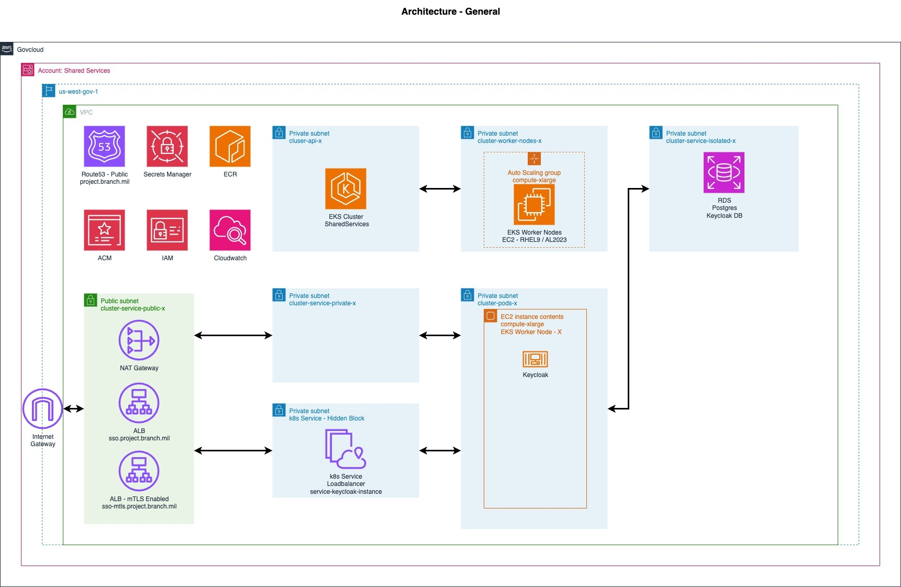

# Welcome to Shared Services project

The CDK portion will create the necessary infrastructure needed to deploy the Shared Services Applications.

The `k8s/overlay/dev` contains the actual applications

It is possible to disable mTLS requirements if you don't want to support direct integration of smartcard authentication.

## Architecture Diagram



## Services
* Keycloak
* Squid Proxy

## Useful commands

* `npm run build`   compile typescript to js
* `npm run watch`   watch for changes and compile
* `npm run test`    perform the jest unit tests
* `npx cdk deploy`  deploy this stack to your default AWS account/region
* `npx cdk diff`    compare deployed stack with current state
* `npx cdk synth`   emits the synthesized CloudFormation template

## Prerequisites
* NodeJS 20.X
* OpenJDK 17 SDK
* A valid domain with management
* Able to create Domain Delegates from your primary Domain

### Subnet Tagging 
* All public facing subnets to be used as an ingress to the services have have the following tags to support [Subnet auto-discovery](https://kubernetes-sigs.github.io/aws-load-balancer-controller/latest/deploy/subnet_discovery/). Value can be 1 or Empty Value
  * `kubernetes.io/role/elb`
* All private subnets for internal load balancers. Value can be 1 or Empty Value
  * `kubernetes.io/role/internal-elb`
* To specify **pods** deployment subnets using [vpc-cni subnet discovery](https://github.com/aws/amazon-vpc-cni-k8s?tab=readme-ov-file#enable_subnet_discovery-v1180). Value can be 1 or Empty Value
  * `kubernetes.io/role/cni`

## Notes on Update the Configuration
All configurations are stored inside the folder `env`. By default, it will use the `/env/dev/configuration.yaml` as environment **dev**.
In order to use alternative `configuration.yaml` files, create a subfolder inside `/env` and export the environment variable **ENVIRONMENT** with the folder name.

## To Deploy the Stack
> Create DNS Hosted Zones and EKS Cluster(s)

1. Update or Create a new Configuration in `/env/<folder>`. The default environment if not specified environment variable `ENVIRONMENT` is **dev**, which resolves to use the configuration.yaml `configuration.yaml` inside `/env/dev`
   > NOTE: ENVIRONMENT variable is the name of the subfolder in `/env`. 
   ```bash
   export ENVIRONMENT=dev
   ```

2. Deploy the stack
   > NOTE: `--output`, `--debug` is **optional**
   ```bash
   cdk context --clear; cdk deploy --require-approval never --debug --output $AWS_PROFILE.$AWS_DEFAULT_REGION.cdk.out --force SharedServicesStack && cdk deploy --require-approval never --all --debug --output $AWS_PROFILE.$AWS_DEFAULT_REGION.cdk.out --force
   ```
3. Execute the `aws eks update-config` command output (`clusterSharedServicesstackConfigCommand`) by the stack  
   Sample Command
   ```bash
   aws eks update-kubeconfig --name SharedServices --region us-east-1 --role-arn arn:aws:iam::992382523718:role/cluster-SharedServices-stack-cluster-admin-role
   ```

## To deploy Keycloak with RDS
> Deploy Keycloak with Aurora PostgreSQL database

1. Build the mTLS AWS Load Balancer Service Provider Interface (SPI) Plugin for Keycloak
   ```bash
   cd plugins/java/keycloak/keycloak-spi-awsalb-mtls
   ./gradlew clean build
   cd -
   ```

2. Generate RDS resources
   ```bash
   ./k8s/base/keycloak/scripts/pre-deploy-keycloak.sh [cluster-name] [region]
   ```

3. Deploy infrastructure resources (RDS, etc.)
   ```bash
   kubectl apply --kustomize k8s/overlay/dev
   ```

4. Wait for RDS cluster to be available
   ```bash
   kubectl get dbcluster -n keycloak
   # Wait for STATUS: available
   ```

5. Update files with actual RDS endpoint and secret names
   ```bash
   ./k8s/base/keycloak/scripts/post-deploy-keycloak.sh [cluster-name] [region]
   ```

6. Deploy applications
   ```bash
   kubectl apply --kustomize k8s/overlay/dev/post
   ```


## Services
### NiFiKop

#### Upgrade helm templates
1. Navigate to `k8s/base/nifikop`
2. Run the following helm template
   ```bash
   helm template nifikops \
    oci://ghcr.io/konpyutaika/helm-charts/nifikop \
    --namespace=nifikop \
    --include-crds \
    --set image.tag=v1.13.0-release \
    --set resources.requests.memory=256Mi \
    --set resources.requests.cpu=250m \
    --set resources.limits.memory=256Mi \
    --set resources.limits.cpu=250m \
    --set logLevel=Debug \
    --set namespaces={"nifi,nifikop"} | kubectl slice --output-dir .
   ```


#### (Internal) Scan for IAM Role Action
```bash
./generateIAMAction.ps1 -Enhance -TemplateFile (Get-ChildItem -File -Filter *.template.json -Path /Users/jktruong/workspace/engagements/denali/project-denali/keycloak-workstream/shared-services/denali-project-consultants-Admin.us-west-1.cdk.out | Select-Object -ExpandProperty FullName) -Since (Get-Date).AddHours(-72) -RoleArn arn:aws:iam::908027385618:role/cdk-hnb659fds-cfn-exec-role-908027385618-us-west-1 
```


## (Isolated Cluster) Access to Local Machine using SSM
> This is meant for a local machine that have internet connectivity to AWS Endpoint Services
### References
* https://docs.aws.amazon.com/systems-manager/latest/userguide/session-manager-getting-started-enable-ssh-connections.html

### Getting started

1. Get **kubeconfig** from cluster
   Sample Command
   >Adjust partition, account id region
   ```bash
   aws eks update-kubeconfig --name SharedServices-GA --region us-east-1 --role-arn arn:aws:iam::908027385618:role/AWSAccelerator-ClusterAdminRole-SharedServices-GA
   ```
2. Retrieve private key from [AWS System Manager > Parameter Store](https://console.aws.amazon.com/systems-manager/parameters).  
   Name is usually under `/ec2/keypair/xxxxxxxxx`.  
   Save it as `instance.key` 
   ```bash
   aws ssm get-parameters-by-path --path /ec2/keypair --region us-east-1 --with-decryption --query 'Parameters[*].{Name:Name,Value:Value}' --output text > instance.key
   chmod 400 instance.key
   ```
3. Create a new `~/.ssh/config` entry and add the following
   ```
   # SSH over Session Manager
    Host i-* mi-*
    ProxyCommand sh -c "aws ssm start-session --target %h --document-name AWS-StartSSHSession --parameters 'portNumber=%p'"
    User ec2-user
   ```
4. Get the EC2 instance ID and record it
5. Open another shell terminal and run the following command
   Replace `{{EC2 instance ID}}` with the instance id 
   ```bash
   ssh -D 8080 -qN {{EC2 instance ID}}
   ```
6. Update the kubeconfig of the target cluster with proxy
   ```bash
   kubectl config set-cluster arn:aws:eks:us-east-1:908027385618:cluster/SharedServices-GA --proxy-url socks5://localhost:8080
   ```

7. Verify by running `kubectl get pod -A`

   Sample Output
   ```
   # kubectl get po -A  

   NAMESPACE           NAME                                                              READY   STATUS             RESTARTS           AGE
   amazon-cloudwatch   amazon-cloudwatch-observability-controller-manager-6dc795czms4z   1/1     Running            0                  2d8h
   amazon-cloudwatch   cloudwatch-agent-nxgbt                                            1/1     Running            0                  2d8h
   amazon-cloudwatch   fluent-bit-mcv5z                                                  1/1     Running            0                  2d8h
   cert-manager        cert-manager-cainjector-6f9f7458fd-xgfnb                          1/1     Running            0                  2d8h
   cert-manager        cert-manager-f446f79d7-tq7jx                                      1/1     Running            0                  2d8h
   cert-manager        cert-manager-webhook-6ccc89459c-zmlh8                             1/1     Running            0                  2d8h
   external-dns        blueprints-addon-external-dns-65484bb8b8-4qdfq                    1/1     Running            0                  2d8h
   keycloak            keycloak-instance-0                                               1/1     Running            0                  15h
   keycloak            keycloak-instance-1                                               1/1     Running            0                  15h
   keycloak            keycloak-instance-2                                               1/1     Running            0                  15h
   keycloak            keycloak-operator-57fd85dccc-q2bjp                                1/1     Running            0                  16h
   keycloak            postgresql-db-0                                                   1/1     Running            0                  15h
   kube-system         aws-load-balancer-controller-5c8ccdf6d9-28dxv                     1/1     Running            0                  2d8h
   kube-system         aws-load-balancer-controller-5c8ccdf6d9-bgsm6                     1/1     Running            0                  2d8h
   kube-system         aws-node-q5f59                                                    2/2     Running            0                  2d8h
   kube-system         blueprints-addon-cluster-autoscaler-aws-cluster-autoscalerlmj6m   1/1     Running            0                  2d8h
   kube-system         blueprints-addon-metrics-server-67755f8bdd-hr29x                  1/1     Running            0                  2d8h
   kube-system         blueprints-addon-secret-store-csi-driver-secrets-store-csinlmsw   1/3     CrashLoopBackOff   1278 (2m26s ago)   2d8h
   kube-system         coredns-789f8477df-bpl9m                                          1/1     Running            0                  2d8h
   kube-system         coredns-789f8477df-jwk28                                          1/1     Running            0                  2d8h
   kube-system         csi-secrets-store-provider-aws-spjqp                              0/1     ImagePullBackOff   0                  2d8h
   kube-system         ebs-csi-controller-84f6cbf49c-b65dr                               6/6     Running            0                  2d8h
   kube-system         ebs-csi-controller-84f6cbf49c-z8zpr                               6/6     Running            0                  2d8h
   kube-system         ebs-csi-node-9v5lg                                                3/3     Running            0                  2d8h
   kube-system         efs-csi-controller-68d5cdf6bb-4xflp                               3/3     Running            0                  2d8h
   kube-system         efs-csi-controller-68d5cdf6bb-8t4nf                               3/3     Running            0                  2d8h
   kube-system         efs-csi-node-bzb2l                                                3/3     Running            0                  2d8h
   kube-system         kube-proxy-ff47j                                                  1/1     Running            0                  2d8h
   squid               squid-deployment-79df4b678-8l6d4                                  1/1     Running            0                  16h
   ```

### Troubleshooting

#### Sample command to test ALB routing
> For domain routing is not ready or configured

```bash
curl -vkL https://k8s-keycloakwebui-98c2b921dc-1216040023.us-gov-west-1.elb.amazonaws.com/admin --header 'Host: sso.denali.jktruong.people.aws.dev'
```