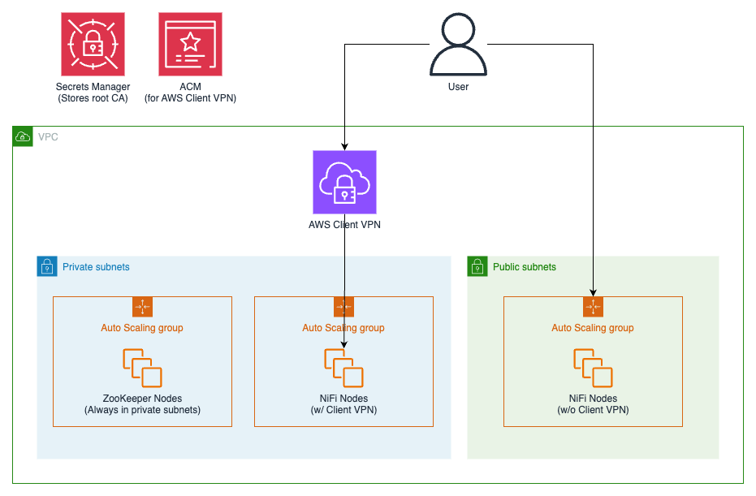

# NiFi Deployment

## Architecture Diagram



## Pre-Requisites

Core requirements:

1. Repository cloned with all solution files, including CloudFormation templates
2. Binaries
   - Apache ZooKeeper (e.g. https://dlcdn.apache.org/zookeeper/zookeeper-3.8.4/apache-zookeeper-3.8.4-bin.tar.gz)
   - Apache NiFi (e.g. https://dlcdn.apache.org/nifi/2.5.0/nifi-2.5.0-bin.zip)
3. DoD CA Bundle (e.g. https://dl.dod.cyber.mil/wp-content/uploads/pki-pke/zip/unclass-certificates_pkcs7_DoD.zip)
4. Existing VPC with:
   1. At least two PRIVATE subnets across different AZs, each with:
      - S3 Gateway endpoint routing configured
      - Interface endpoints with a security group that allows inbound access on port 443 from VPC CIDR (no outbound access is required):
        - SSM
        - SSM Messages
        - EC2 Messages
        - Secrets Manager
      - Internet access (via proxy server)
   2. If AWS Client VPN cannot be used, at least two PUBLIC subnets across different AZs, each with:
      - S3 Gateway endpoint routing configured
      - Internet access (via proxy server)
5. Service-linked roles:
   - [AWSServiceRoleForImageBuilder](https://docs.aws.amazon.com/imagebuilder/latest/userguide/image-builder-service-linked-role.html#image-builder-slr-permissions)
   - [AWSServiceRoleForAutoScaling](https://docs.aws.amazon.com/autoscaling/ec2/userguide/autoscaling-service-linked-role.html#create-service-linked-role)

Additional requirements if using AWS Client VPN:

6. VPN Client Software
   - [AWS-provided client](https://docs.aws.amazon.com/vpn/latest/clientvpn-user/connect-aws-client-vpn-connect.html) or
   - [OpenVPN client](https://docs.aws.amazon.com/vpn/latest/clientvpn-user/connect.html)
7. Access to a secure Linux-based system configured with AWS CLI and appropriate credentials
8. Access to AWS Certificate Manager

## Deployment Steps

### 1. Upload assets to S3 bucket

1. Navigate to S3 console.
2. Select an existing bucket (or [create a new one](https://docs.aws.amazon.com/AmazonS3/latest/userguide/create-bucket-overview.html)).
3. (Optional) Enable [versioning](https://docs.aws.amazon.com/AmazonS3/latest/userguide/Versioning.html) on the bucket.
4. Click `Upload`.
5. Click `Add folder`.
6. Select the `nifi` folder from your cloned repository.
7. Click `Upload`.

### 2. Set up private CA

This solution uses AWS Secrets Manager as a cost-effective alternative to AWS Private Certificate Authority (AWS Private CA) for storing and managing the root CA private key and certificate. This "poor man's CA" approach reduces costs while providing secure storage with encryption at rest and fine-grained access controls. The setup manually generates OpenSSL-based certificates and stores them in Secrets Manager, making it suitable for development, testing, or environments where the full feature set and compliance certifications of AWS Private CA are not required. This approach serves as an interim solution until authorization is granted for AWS Private CA or budget approval is obtained for the managed service.

Provision two AWS Secrets Manager secrets to store root CA private key and certificate:

1. Navigate to S3 console.
2. Locate the `aftac_root_ca_stack.yaml` template that was uploaded to the S3 bucket [above](#1-upload-assets-to-s3-bucket).
3. Select the template and click `Copy URL`.
4. Navigate to CloudFormation console.
5. Click `Stacks` in the left navigation pane.
6. Click `Create stack` and select `With new resources (standard)`.
7. Paste the S3 URL copied earlier in `Amazon S3 URL`.
8. Click `Next`.
9. Enter a sensible name for the stack.
10. Provide a value for the following parameter:
    - Resource Suffix: Enter a unique identifier that prevents resource naming conflicts and allows multiple instances of the template.
11. Click `Next`.
12. Click `Next`.
13. Click `Submit`.
14. Wait for stack creation to complete (status: `CREATE_COMPLETE`).

Generate and store root CA private key and certificate:

1. Click `Resources` tab for the stack.
2. Click the hyperlink next to `RootCertificateAuthorityKey` logical ID, which opens up the secret in a new tab.
3. Click `Retrieve secret value`.
4. Click `Set secret value`.
5. Click `Plaintext` tab.
6. Replace `{}` with the output from running the following command on a secure system:
   ```
   openssl genrsa -out ca.key 2048 && cat ca.key
   ```
7. Click `Save`.
8. Go back to `Resources` tab for the stack.
9. Click the hyperlink next to `RootCertificateAuthorityCertificate` logical ID, which opens up the secret in a new tab.
10. Click `Retrieve secret value`.
11. Click `Set secret value`.
12. Click `Plaintext` tab.
13. Replace `{}` with the output from running the following command on a secure system (customize the `subj` as necessary):
    ```
    openssl req -x509 -new -key ca.key -sha256 -days 3650 -out ca.pem -subj /CN=RootCA/OU=nifi/O=DoD/C=US && cat ca.pem && shred -u ca.key ca.pem
    ```
14. Click `Save`.

### 3. Set up ZooKeeper cluster

Apache ZooKeeper serves as the coordination service for the NiFi cluster, providing centralized configuration management, distributed synchronization, and cluster state coordination. It maintains critical cluster information such as node membership, leader election data, and shared configuration across all NiFi instances. ZooKeeper ensures high availability and consistency by requiring a quorum of nodes to be operational, making it essential for NiFi's clustered architecture to function reliably in a distributed environment.

Create the infrastructure:

1. Navigate to S3 console.
2. Locate the `aftac_zk_stack.yaml` template that was uploaded to the S3 bucket [above](#1-upload-assets-to-s3-bucket).
3. Select the template and click `Copy URL`.
4. Navigate to CloudFormation console.
5. Click `Stacks` in the left navigation pane.
6. Click `Create stack` and select `With new resources (standard)`.
7. Paste the S3 URL copied earlier in `Amazon S3 URL`.
8. Click `Next`.
9. Enter a sensible name for the stack.
10. Provide values for the following parameters:
    1. General:
       - IAM Prefix
       - Permissions Boundary Policy ARN
       - Resource Suffix: Enter a unique identifier that prevents resource naming conflicts and allows multiple instances of the template.
    2. ZooKeeper:
       - ZooKeeper Instance Type
       - ZooKeeper Instance Volume Type
       - ZooKeeper Instance Volume Size
       - ZooKeeper Instance Volume IOPS
       - ZooKeeper Instance Volume Throughput
       - ZooKeeper Cluster Size
       - ZooKeeper Binary S3 URI: Upload the binary to the S3 bucket [above](#1-upload-assets-to-s3-bucket) and enter its URI (not URL).
    3. Networking:
       - VPC ID
       - VPC CIDR
       - Private Subnet IDs
       - S3 Prefix List ID: Follow the instructions in the [AWS documentation](https://docs.aws.amazon.com/vpc/latest/userguide/working-with-aws-managed-prefix-lists.html#available-aws-managed-prefix-lists) to find this value in the console.
    4. Image Builder:
       - Semantic Version: Increment the version (e.g. 1.0.0 -> 1.0.1) when making changes to any parameters in this section, except for Outbound CIDR.
       - Parent Image
       - Proxy Server Address
       - No Proxy List
       - Bypass GPG Check
       - Outbound CIDR
    5. Email Address for Notifications
       - Email Address
11. Click `Next`.
12. (Optional) Under `Behavior on provisioning failure`, check `Preserve successfully provisioned resources` to prevent a rollback (and subsequent deletion) in case of a failure. This can save overall deployment time and help with troubleshooting. Note that it should be set to `Roll back all stack resources` after the initial stack creation; otherwise, stack updates can fail. Refer to the [AWS documentation](https://docs.aws.amazon.com/AWSCloudFormation/latest/UserGuide/stack-failure-options.html) for more info.
13. Under `Capabilities`, check the acknowledgment box(es).
14. Click `Next`.
15. Click `Submit`.
16. Wait for stack creation to complete (status: `CREATE_COMPLETE`).

Produce a ZooKeeper image using the pipeline:

1. Navigate to EC2 Image Builder console.
2. Click `Image pipelines` in the left navigation pane.
3. Click the pipeline whose name follows `zookeeper-image-pipeline-${ResourceSuffix}` pattern.
4. Click `Actions` on the top right, then select `Run pipeline`.
5. Refresh the page.
6. Under `Output images`, wait for the latest version's `Image status` to become `Available`.
7. (Optional) Monitor progress or troubleshoot failures by viewing the latest log stream.

Refresh instances in Auto Scaling Group:

1. Navigate to EC2 console.
2. Click `Auto Scaling Groups` in the left navigation pane.
3. Click the auto scaling group whose name follows `zookeeper-asg-${ResourceSuffix}` pattern.
4. Click `Instance refresh` tab.
5. Click `Start instance refresh` button.
6. Under `Availability settings`, set `Min` to `0`.
7. Click `Start instance fresh` at the bottom of the page.
8. Wait for the instance refresh to complete, by monitoring `Instance refresh status` to turn to `Successful`.

Verify ZooKeeper cluster is functioning:

1. Click `Instances` in the left navigation pane.
2. Select an instance whose name follows `zookeeper-node-${ResourceSuffix}` pattern.
3. Click `Connect`.
4. Click `Session Manager` tab.
5. Click `Connect`, which opens up a new tab.
6. Run the following commands:

   ```
   sudo su -
   cd $ZK_HOME/bin
   ./zkServer.sh status
   ```

   The output should look similar to this:

   ```
   /usr/bin/java
   ZooKeeper JMX enabled by default
   Using config: /root/apache-zookeeper-3.8.4-bin/bin/../conf/zoo.cfg
   Client port not found in static config file. Looking in dynamic config file.
   Client port found: 2181. Client address: x.x.x.x. Client SSL: false.
   Mode: leader|follower
   ```

7. If not, run `./zkServer.sh start` command, wait a few seconds, and run `./zkServer.sh status` command to check the status again.
8. Repeat steps 2 - 7 for the remaining instances.

Troubleshooting:

1. Check logs inside `$ZK_HOME/logs` directory.
2. If you make changes to the LaunchTemplate resource in the template after the initial deployment:
   1. Set the latest version of the launch template as the [default version](https://docs.aws.amazon.com/AWSEC2/latest/UserGuide/manage-launch-template-versions.html#set-default-launch-template-version).
   2. Set the Auto Scaling Group to use the [default version of the launch template](https://docs.aws.amazon.com/autoscaling/ec2/userguide/create-asg-launch-template.html).
   3. Create another image.
   4. Refresh instances.

Future Enhancements:

1. Enable secure client-server communication.

### 4. Set up NiFi cluster

Apache NiFi operates as a distributed cluster to provide high availability, load distribution, and fault tolerance for data processing workflows. The cluster architecture enables multiple NiFi nodes to work together, sharing the processing load while maintaining data flow consistency across all instances. Each node in the cluster can process data independently, but they coordinate through ZooKeeper to ensure cluster-wide state management, flow synchronization, and automatic failover capabilities. This clustered approach allows for horizontal scaling to handle increased data volumes and provides resilience against individual node failures without disrupting ongoing data processing operations.

Create the infrastructure:

1. Navigate to S3 console.
2. Locate the `aftac_nifi_stack.yaml` template that was uploaded to the S3 bucket [above](#1-upload-assets-to-s3-bucket).
3. Select the template and click `Copy URL`.
4. Navigate to CloudFormation console.
5. Click `Stacks` in the left navigation pane.
6. Click `Create stack` and select `With new resources (standard)`.
7. Paste the S3 URL copied earlier in `Amazon S3 URL`.
8. Click `Next`.
9. Enter a sensible name for the stack.
10. Provide values for the following parameters:
    1. General:
       - IAM Prefix
       - Permissions Boundary Policy ARN
       - Resource Suffix: Enter a unique identifier that prevents resource naming conflicts and allows multiple instances of the template.
    2. Root CA:
       - Root Key Secret ARN: Enter the value for `RootCAKeySecretArn` key from the stack Outputs [from here](#2-set-up-a-private-ca).
       - Root Certificate Secret ARN: Enter the value for `RootCACertSecretArn` key from the stack Outputs [from here](#2-set-up-a-private-ca).
       - Root CA KMS Key ARN: Enter the value for `RootCAKmsKeyArn` key from the stack Outputs [from here](#2-set-up-a-private-ca).
    3. NiFi:
       - NiFi Admin User
       - NiFi Instance Type
       - NiFi Instance Volume Type
       - NiFi Instance Volume Size
       - NiFi Instance Volume IOPS
       - NiFi Instance Volume Throughput
       - NiFi Cluster Size
       - NiFi Binary S3 URI: Upload the binary to the S3 bucket [above](#1-upload-assets-to-s3-bucket) and enter its URI (not URL).
       - DoD Cert Bundle S3 URI: Upload the bundle to the S3 bucket [above](#1-upload-assets-to-s3-bucket) and enter its URI (not URL).
       - ZooKeeper Cluster Information Parameter: Enter the value for `ZkClusterInfoParameterName` key from the stack Outputs [from here](#3-set-up-zookeeper-cluster).
    4. Networking:
       - VPC ID
       - VPC CIDR
       - Subnet IDs: Select private subnets if using AWS Client VPN; otherwise, select public subnets.
       - Allowed Source CIDR: Enter CIDR from which to allow access to NiFi nodes **ONLY IF** they are placed in **public** subnets. Otherwise, leave it blank.
       - S3 Prefix List ID: Follow the instructions in the [AWS documentation](https://docs.aws.amazon.com/vpc/latest/userguide/working-with-aws-managed-prefix-lists.html#available-aws-managed-prefix-lists) to find this value in the console.
    5. Image Builder:
       - Semantic Version: Increment the version (e.g. 1.0.0 -> 1.0.1) when making changes to any parameters in this section, except for Outbound CIDR.
       - Parent Image
       - Proxy Server Address
       - No Proxy List
       - Bypass GPG Check
       - Outbound CIDR
    6. Email Address for Notifications
       - Email Address
11. Click `Next`.
12. (Optional) Under `Behavior on provisioning failure`, check `Preserve successfully provisioned resources` to prevent a rollback (and subsequent deletion) in case of a failure. This can save overall deployment time and help with troubleshooting. Note that it should be set to `Roll back all stack resources` after the initial stack creation; otherwise, stack updates can fail. Refer to the [AWS documentation](https://docs.aws.amazon.com/AWSCloudFormation/latest/UserGuide/stack-failure-options.html) for more info.
13. Under `Capabilities`, check the acknowledgment box(es).
14. Click `Next`.
15. Click `Submit`.
16. Wait for stack creation to complete (status: `CREATE_COMPLETE`).

Produce a NiFi image using the pipeline:

1. Navigate to EC2 Image Builder console.
2. Click `Image pipelines` in the left navigation pane.
3. Click the pipeline whose name follows `nifi-image-pipeline-${ResourceSuffix}` pattern.
4. Click `Actions` on the top right, then select `Run pipeline`.
5. Refresh the page.
6. Under `Output images`, wait for the latest version's `Image status` to become `Available`.
7. (Optional) Monitor progress or troubleshoot failures by viewing the latest log stream.

Refresh instances in Auto Scaling Group:

1. Navigate to EC2 console.
2. Click `Auto Scaling Groups` in the left navigation pane.
3. Click the auto scaling group whose name follows `nifi-asg-${ResourceSuffix}` pattern.
4. Click `Instance refresh` tab.
5. Click `Start instance refresh` button.
6. Under `Availability settings`, set `Min` to `0`.
7. Click `Start instance fresh` at the bottom of the page.
8. Wait for the instance refresh to complete, by monitoring `Instance refresh status` to turn to `Successful`.

Verify NiFi cluster is functioning:

1. Click `Instances` in the left navigation pane.
2. Select an instance whose name follows `nifi-node-${ResourceSuffix}` pattern.
3. Click `Connect`.
4. Click `Session Manager` tab.
5. Click `Connect`, which opens up a new tab.
6. Run the following commands:

   ```
   sudo su -
   cd $NIFI_HOME/bin
   ./nifi.sh status
   ```

   The output should look similar to this:

   ```
   INFO [main] org.apache.nifi.bootstrap.Command Application Process [6819] Command Status [SUCCESS] HTTP 200
   INFO [main] org.apache.nifi.bootstrap.Command Status: UP
   ```

7. If not, run `./nifi.sh start` command, wait a couple of minutes, and run `./nifi.sh status` command to check the status again.
8. Repeat steps 2 - 7 for the remaining instances.

Troubleshooting:

1. Check logs inside `$NIFI_HOME/logs` directory.
2. If you make changes to the LaunchTemplate resource in the template after the initial deployment:
   1. Set the latest version of the launch template as the [default version](https://docs.aws.amazon.com/AWSEC2/latest/UserGuide/manage-launch-template-versions.html#set-default-launch-template-version).
   2. Set the Auto Scaling Group to use the [default version of the launch template](https://docs.aws.amazon.com/autoscaling/ec2/userguide/create-asg-launch-template.html).
   3. Create another image.
   4. Refresh instances.
3. If you add additional nodes to an existing cluster, it requires manual process to synchronize authorizations.xml, users.xml, and flow.json.gz across all nodes, both existing and new.

Future Enhancements:

1. Create a NiFi user and specify it bootstrap.conf
2. Run NiFi as a service
3. Customize repos
4. Add NiFi Registry
5. Specify heap size in bootstrap.conf?

### 5. Set up AWS Client VPN

_If not using AWS Client VPN, skip this section._

AWS Client VPN allows users to access NiFi nodes that are running in private subnets by establishing a secure, encrypted connection from their local machines to the VPC. This eliminates the need to expose NiFi instances to the public internet while still providing remote access for administrators and users. Client VPN creates a managed VPN endpoint that authenticates users and routes traffic to the private resources, ensuring that sensitive data processing workflows remain isolated within the private network infrastructure while maintaining operational accessibility.

Create the infrastructure:

1. Navigate to S3 console.
2. Locate the `aftac_client_vpn_stack.yaml` template that was uploaded to the S3 bucket [above](#1-upload-assets-to-s3-bucket).
3. Select the template and click `Copy URL`.
4. Navigate to CloudFormation console.
5. Click `Stacks` in the left navigation pane.
6. Click `Create stack` and select `With new resources (standard)`.
7. Paste the S3 URL copied earlier in `Amazon S3 URL`.
8. Click `Next`.
9. Enter a sensible name for the stack.
10. Provide values for the following parameters:
    1. General:
       - IAM Prefix
       - Permissions Boundary Policy ARN
       - Resource Suffix: Enter a unique identifier that prevents resource naming conflicts and allows multiple instances of the template.
    2. Root CA:
       - Root Key Secret ARN: Enter the value for `RootCAKeySecretArn` key from the stack Outputs [from here](#2-set-up-a-private-ca).
       - Root Certificate Secret ARN: Enter the value for `RootCACertSecretArn` key from the stack Outputs [from here](#2-set-up-a-private-ca).
    3. Client VPN Endpoint:
       - Server Certificate ARN: Leave **blank** during the initial stack creation. After creation, update with ARN of server certificate generated using commands from stack Outputs (instructions below). The certificate is stored in AWS Certificate Manager (ACM) for the Client VPN endpoint.
       - VPC ID: Enter the ID of the VPC where NiFi cluster is deployed.
       - VPC CIDR
       - Private Subnet IDs: Select two (2) private subnets across different AZs.
       - Client CIDR Block: IPv4 address range in CIDR notation, from which to assign client IP addresses
         1. It **CANNOT** be updated after the initial stack creation.
         2. It **MUST NOT OVERLAP** with the local CIDR of the VPC or the routes that you add manually.
         3. It must have a size of **at least /22 and not be greater than /12**; if unsure, specify /16 or larger.
       - Session Timeout Hours
       - DNS Server Addresses
       - Banner Text
    4. Authorized Client Common Names
       - Authorized Common Names: This can act as an additional layer of access control.
11. Click `Next`.
12. (Optional) Under `Behavior on provisioning failure`, check `Preserve successfully provisioned resources` to prevent a rollback (and subsequent deletion) in case of a failure. This can save overall deployment time and help with troubleshooting. Note that it should be set to `Roll back all stack resources` after the initial stack creation; otherwise, stack updates can fail. Refer to the [AWS documentation](https://docs.aws.amazon.com/AWSCloudFormation/latest/UserGuide/stack-failure-options.html) for more info.
13. Under `Capabilities`, check the acknowledgment box(es).
14. Click `Next`.
15. Click `Submit`.
16. Wait for stack creation to complete (status: `CREATE_COMPLETE`).

Generate server certificate and obtain ACM certificate ARN:

1. From the stack Outputs, copy the value for `HowToCreateServerKeyAndCert` key, which is a series of commands.
2. Execute the commands on a secure Linux-based system configured with proper AWS credentials.
3. When prompted, enter your preferred Common Name for the server.
4. Successful execution will output a certificate ARN similar to this:

   ```json
   {
     "CertificateArn": "arn:<PARTITION>:acm:<REGION>:<ACCOUNT_ID>:certificate/xxxxxxxx-xxxx-xxxx-xxxx-xxxxxxxxxxxx"
   }
   ```

5. Copy the `CertificateArn` value.
6. Navigate back to CloudFormation console.
7. Update the stack by pasting the copied ARN in `Server Certificate ARN` parameter.
8. Wait for stack update to complete (status: `UPDATE_COMPLETE`)

Generate VPN configuration files for users:

1. From the stack Outputs, copy the value for `HowToCreateClientKeyAndCert` key, which is a series of commands.
2. Execute the commands on a secure Linux-based system configured with proper AWS credentials.
3. When prompted, enter Common Name for the user you are creating the file for.
4. Successful execution will include an output similar to this:

   ```
   Send to the intended user the config file at the following location: /tmp/tmp.iPjnkjguUn/John.Lennon_config_file.ovpn

   ***IMPORTANT*** Delete the config file using the following command:
   shred -u /tmp/tmp.iPjnkjguUn/John.Lennon_config_file.ovpn
   ```

5. Using the above example output:
   1. Securely transfer the generated `.ovpn` file (which contains client private key and certificate) to the user.
   2. Delete the file using the provided `shred` command.
6. Repeat steps 1 - 5 for each user requiring VPN access.

Future Enhancements:

1. Implement AWS Private Certificate Authority for improved certificate management.

## Access NiFi cluster

### 1. Connect to AWS Client VPN

_If not using AWS Client VPN, skip this section._

1. Users need to install a VPN Client Software.
2. For AWS-provided VPN Client Software:
   1. Open AWS VPN Client software.
   2. Go to `File` and select `Manage Profiles`.
   3. Click `Add Profile`.
   4. Enter a value in `Display Name` and select the VPN configuration file generated for you.
   5. Click `Add Profile`.
   6. Click `Done`.
   7. Click `Connect` for the newly created profile.

Troubleshooting:

1. If connection issues occur, ensure no conflicting VPN connections are active.
2. Verify correct DNS settings if unable to resolve internal resources.
3. Check AWS VPC and security group configurations if experiencing connectivity problems to specific resources.

### 2. Connect to NiFi cluster

1. Access NiFi web interface at `https://<IP_Address>:8443/nifi`
   - Replace `<IP_Address>` with either:
     - Private IP when using AWS Client VPN
     - Public IP when NOT using AWS Client VPN
2. If you are the admin, configure user access and policies as needed.

## Notes

1. How to convert CRL from ACM to PEM format compatible with Client VPN
   `openssl crl -inform DER -in acm_crl.crl -outform PEM -out acm_crl.pem`

## TODOs:

1. ZooKeeper:
   1. Reference: https://zookeeper.apache.org/doc/current/zookeeperAdmin.html
   2. Having a supervisory process such as daemontools or SMF (other options for supervisory process are also available, it's up to you which one you would like to use, these are just two examples) managing your ZooKeeper server ensures that if the process does exit abnormally it will automatically be restarted and will quickly rejoin the cluster.
      1. Set it up in a way that sends a notification to SNS topic for monitoring?
   3. Use `secureClientPort`
   4. Be careful where you put the transaction log. A dedicated transaction log device is key to consistent good performance. Putting the log on a busy device will adversely affect performance.
      1. `dataLogDir` : This option will direct the machine to write the transaction log to the dataLogDir rather than the dataDir. This allows a dedicated log device to be used, and helps avoid competition between logging and snapshots. Having a dedicated log device has a large impact on throughput and stable latencies. It is highly recommended dedicating a log device and set dataLogDir to point to a directory on that device, and then make sure to point dataDir to a directory not residing on that device. The most performance critical part of ZooKeeper is the transaction log. ZooKeeper syncs transactions to media before it returns a response. A dedicated transaction log device is key to consistent good performance. Putting the log on a busy device will adversely affect performance. If you only have one storage device, increase the snapCount so that snapshot files are generated less often; it does not eliminate the problem, but it makes more resources available for the transaction log.
